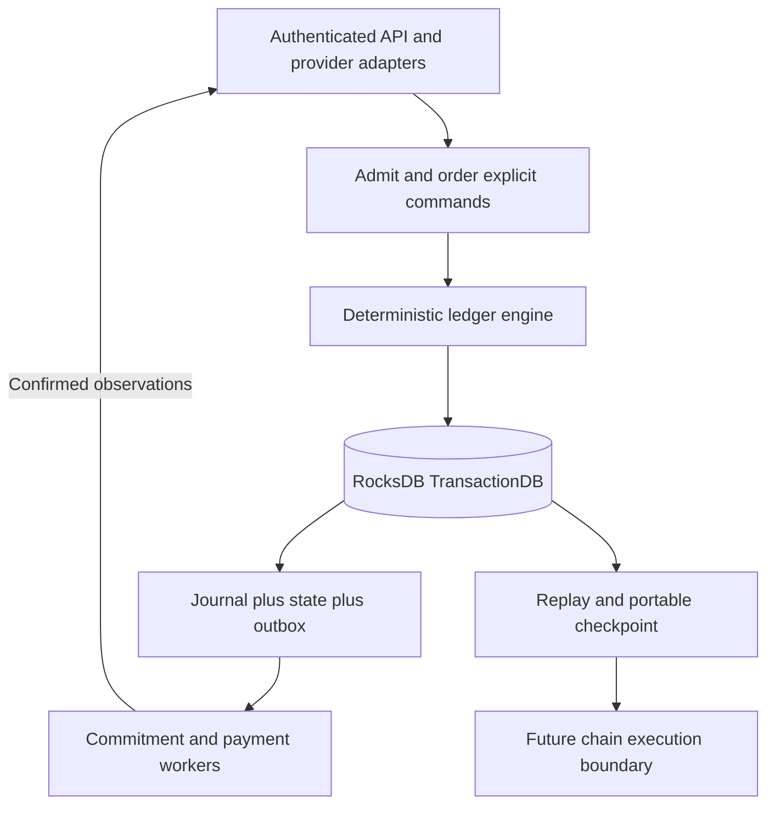

# London APPROVED: Build first: deterministic RocksDB ledger

--- id: 27-deterministic-rocksdb-ledger title: "Build first: deterministic RocksDB ledger" sidebarposition: 2.5 --- APPROVED · IMPLEMENTATION SPECIFICATION · London 0.1.0 First implementation priority Build the deterministic streaming and accounting ledger before the surrounding product integrations. This is the approved London storage architecture and the first engineering milestone. RocksDB replaces the earlier.

## Connected knowledge

- describes: [[London Mainnet architecture (APPROVED)|London Mainnet architecture (APPROVED)]] (EXTRACTED)
- describes: [[London delivery evidence (APPROVED)|London delivery evidence (APPROVED)]] (EXTRACTED)
- describes: [[London USDC settlement (APPROVED)|London USDC settlement (APPROVED)]] (EXTRACTED)
- describes: [[London deterministic RocksDB ledger (APPROVED)|London deterministic RocksDB ledger (APPROVED)]] (EXTRACTED)

## Source content

---
id: 27-deterministic-rocksdb-ledger
title: "Build first: deterministic RocksDB ledger"
sidebar_position: 2.5
---

**APPROVED · IMPLEMENTATION SPECIFICATION · London 0.1.0**

## First implementation priority

Build the deterministic streaming and accounting ledger before the surrounding product integrations. This is the approved London storage architecture and the first engineering milestone. RocksDB replaces the earlier PostgreSQL choice. The reason is an explicitly controlled, replayable state-transition engine with a portable logical state model, not an unmeasured claim that every workload is faster.

The engine owns recorded streams, eligibility decisions, funded budgets, allocations, payment obligations and their state transitions. Porto admits and orders commands in London. A future sovereign chain could supply consensus ordering around compatible rules. RocksDB supplies local persistence and transactions; it does not supply network consensus, independently verified listening or automatic chain compatibility.



## Ownership and mutation boundary

Exactly one active Porto ledger-owner process opens the writable database. It is a module of the existing backend, not a new public platform. API handlers, accounting jobs and administrative commands call typed domain operations. Separately credentialed signer/commitment workers call the same authenticated internal command/query interface; they never open the database files or get a generic key/value API. No SQL endpoint, arbitrary Put/Delete, direct balance edit or administrative bypass is permitted.

Use pessimistic `TransactionDB`, write policy `WRITE_COMMITTED`, WAL enabled (`disableWAL=false`), `WriteOptions.sync=true` for every authoritative command. Pin RocksDB and language binding versions in the release profile; prove the binding exposes the required transaction, snapshot and backup APIs. One serial command executor orders mutations in the MVP. Concurrent snapshot reads are allowed. Do not introduce distributed locking, replication or multi-writer execution in this release.

The operating-system database lock is a same-host/file protection, not cross-host fencing. Do not mount one writable directory on two machines or assume a storage snapshot can become a safe second primary. Failover is manual: disable admission/signing, prove the former owner is stopped and its storage/signing access revoked, restore and reconcile, then explicitly promote one replacement. An uncertain old owner means no promotion. Record an operational writer generation in the recovery record; it is not consensus and does not make unsafe failover safe.

## Pure state-transition contract

```text
apply(logical_state, admitted_command)
    -> accepted(new_values, immutable_events, effect_intents, result)
     | rejected(stable_error, result)
```

Core execution cannot read the wall clock, generate random IDs, make network requests, sign chain transactions or depend on thread scheduling. Admission supplies canonical timestamps, random IDs/nonces, verified actor identity and immutable references to verified external observations. The engine checks actor capability and state preconditions against its current logical state. Input timestamps used for expiry/leases must be nondecreasing admission time; historical provider/node event times remain separate payload fields. Timeouts are explicit commands, never hidden background mutations.

Integer arithmetic, ordering, rounding and supported policy versions follow the existing accounting specification. Iterate keys in their defined canonical order. All IDs created by a transition must be present in the admitted payload, or deterministically derived by a documented domain rule; do not call a UUID generator during replay. Unknown command/ruleset versions fail closed. Missing referenced inputs fail replay instead of fetching today's replacement data.

The adapter validates raw provider signatures, node evidence and external chain observations before constructing a command. The command contains the normalized observation and its immutable evidence digest. Replay reproduces the historical admitted observation; it does not magically re-establish the truth of the external event. Full audit can inspect the retained evidence. A future consensus runtime must define its own admission/oracle rules.

## Command envelope and sequence

[Ledger schemas](ledger-schemas.json) defines the closed envelope, journal record and portable checkpoint. Required envelope fields: `schema_version`, `command_id`, `command_type`, `actor_id`, `admitted_at_ms`, `ruleset_version`, `expected_revisions`, `payload`, `evidence_hashes`. Authentication credentials and raw personal data are excluded. Domain payload schemas are the existing API/artifact schemas plus the internal command registry below; unknown fields are errors. IDs are generated before admission and retained across retries.

Compute envelope hash as SHA-256 of UTF-8 `porto:london:command:v1\n` followed by JCS of the full envelope. On transport retries the admission layer reuses the originally stored timestamp, generated IDs and envelope, rather than rebuilding it with current time. A lost response is resolved by command ID.

The owner assigns a strictly increasing u64 sequence at commit under the `meta/head` lock. Sequences have no gaps among committed outcomes. Auth/schema failures before admission go to the private security log, not the ledger. An admitted business rejection is journalled with a stable code, no business effects or business-state changes and a stored result so the same command cannot later succeed accidentally. Both accepted and rejected outcomes advance the head. An exact duplicate command returns its original result without another sequence. Same command ID with a different envelope hash returns `COMMAND_ID_CONFLICT` without a new ledger outcome.

## Atomic commit procedure

Expected revisions are a list of distinct canonical state keys, sorted by key; null means the key must be absent. Record revisions start at 1 and increment once per command that updates that record. Use them for prepared allocations, artifacts and payment runs. The engine also checks all intrinsic preconditions even if a caller omits an optional optimistic revision. Result codes/entity IDs/amount must match the typed command outcome; command results never expose secret bytes.

1. Validate authentication/schema outside the transaction; copy all nondeterministic input into the envelope and persist referenced evidence durably first. A failed DB commit can leave an orphan object, never a ledger reference to bytes not yet stored.
2. Begin a TransactionDB transaction; use `GetForUpdate` on `meta/head`, `command_result/<command_id>`, and every state/uniqueness precondition key. Acquire additional keys in canonical byte order. Check expected record revisions and absence sentinels explicitly. Do not treat ordinary `Get` or an unprotected range scan as a financial lock.
3. Read a consistent transaction snapshot, run `apply`, check conservation, references and bounded output. One serial executor prevents insertion phantoms while scanning; all mutation paths must obey this ownership rule. Future parallel execution requires a separately reviewed range-conflict strategy.
4. In the same transaction append journal and immutable event rows, update authoritative state and uniqueness sentinels, store original result, create outbox intents, update transactional indexes and advance head/digest. A business rejection writes its command-result record, outcome and head; that result record is included in its delta hash. No partial accepted state is visible.
5. Commit with WAL and sync enabled. Return success only after commit reports durable success. On any uncertain I/O/commit result stop admission, reopen/recover and query the command ID before retrying. Do not assume error implies no write.
6. External workers execute durable intents after commit and submit observations as new commands. A RocksDB commit never includes the remote Aptos transfer atomically.

Bound an admitted command to 1 MiB canonical envelope, 10000 state writes and 16 MiB canonical delta. Exceeding a bound returns `COMMAND_TOO_LARGE` with no accepted mutation; do not split a monetary transition silently. Compute allocations per listener-day; aggregate immutable allocation lines into daily files outside the transaction, then freeze their references against expected day revisions. If one listener-day exceeds a limit, hold that day for a reviewed capacity change. The existing 64 MiB artifact limit remains separate.

## Column families and canonical keys

All column families belong to one TransactionDB instance so a transaction spans them atomically. These are storage namespaces, not independently deployed databases. Keys are UTF-8 ASCII paths; UUIDs/hashes use existing canonical encodings; integers in key suffixes use zero-padded 20-digit unsigned decimal so byte order equals numeric order. Values are versioned JCS JSON with integer quantities as canonical decimal strings. Prefix components never contain `/`. Cap key size at 512 bytes. No native struct-memory dumps or language-dependent serialisation.

| Column family | Key examples | Authority and retention |
|---|---|---|
| meta | `head`, `schema`, `ruleset` | Current committed sequence/digest and compatibility versions |
| journal | `<sequence20>` | Immutable command/outcome record; no TTL/compaction filter deletion |
| events | `<sequence20>/<event_index20>` | Immutable domain events and postings |
| state | `session/<id>`, `grant/<id>`, `budget/<id>`, `payment/<id>` | Current logical records and explicit revision; rebuilt by replay |
| unique | `receipt/<id>`, `allocation/<listener_day_id>`, `sender/<address>/<sequence20>` | Required duplicate-prevention sentinels; retained for relevant obligation lifetime |
| command_result | `<command_id>` | Envelope hash, committed sequence and original response; persistent business idempotency |
| outbox | `<effect_id>` | Durable intent and confirmation state; changes only through commands |
| indexes | `recipient/<id>/<day20>/<line_id>`, `active_session/<account_id>` | Transactionally updated query projections; reconstructable, never independent authority |
| private_aux | `identity/<id>`, `provider_secret_ref/<id>` | Private identity mapping/operational metadata; never portable chain state |

Journal, events, state, unique, command_result and outbox are the replayable logical ledger. Indexes are rebuilt and excluded from the logical state digest. `meta/head` is included through checkpoint metadata rather than recursively hashing itself. Private auxiliary data is separately permissioned through the API and excluded from migration exports; it must not be needed to reproduce monetary transitions. Full signed evidence remains in protected object storage, referenced by opaque IDs/hashes. A private reference is not a public URL.

Referential integrity is enforced by the domain engine, not supplied by key/value storage. A required target must exist with the expected revision within the transaction. Every former unique constraint gets a named sentinel or canonical entity key and a test. Financial history, receipt identities and confirmed payout identities cannot be deleted by cleanup jobs. Tombstones are explicit logical state where deletion would permit replay. Compaction may rewrite physical files but must preserve live logical history; RocksDB itself is not append-only storage.

## Internal command registry

Each operation has a typed payload and fixed state effects; the engine must not accept an arbitrary mutation list supplied by a caller. Common UUIDs and timestamps required by the corresponding domain transition are envelope/payload inputs, never hidden core-generated values. Existing request schemas in OpenAPI define externally triggered payloads. The ledger schema bundle pins closed payloads for all 30 command types, including reused API/artifact contracts. Generate the shared implementation types from it; changing business behaviour requires a specification revision.

| Command family | Preconditions / writes / outbox |
|---|---|
| RegisterAccount | Verified identity evidence and preassigned opaque account ID; authorised role provisioning; core stores no raw identity/provider subject |
| ApplyBillingObservation | Verified normalized BillingEvent; account/period and event-ID sentinel; access/funding-readiness event |
| ImportCatalogue / ActivateWork / DisableWork | CatalogueImport or work/version target; rights/content validation; work state and activation/withdrawal event |
| AdmitNode / ChangeNodeStatus / RotateNodeKey | NodeAdmission or node/revision/key snapshot; role checks; node/key state and invalidation intent |
| RecordNodeHealth | HealthRequest plus envelope admission time; inventory/staleness state used by deterministic routing; raw network observations remain trusted adapter inputs |
| UpdateRecipient | Beneficiary/address ownership evidence and finance approval; prospective recipient version; unsigned runs invalidated, signed attempts unchanged |
| OpenSession / CloseSession / IssueGrant / ConsumeGrant | Existing API inputs, explicit generated IDs/grant bytes/time; entitlement/lease/bucket/nonce checks; session/grant/sentinel state |
| RecordReceipt / RecordPeerResult | Signed input reference plus normalized receipt/result; grant/key binding; immutable evidence event, disposition and dedup sentinel |
| CloseDay / DecideHold | Explicit day/target/revision and decision; no hidden clock or discretionary core judgement; frozen eligibility or hold event |
| ImportFunding | FundingImport and verified deposit observation; amount conservation and unique deposit units; budget/funding state |
| AllocateListenerDay | Day/budget/evidence/policy revisions; exact chapter-08 algorithm; allocation sentinel, postings, payable lines |
| FreezeArtifact | Artifact UUID/hash/kind/count/parent/window and expected source revisions; protected bytes already exist; batch state and anchor intent |
| PreparePayoutRun | Exact contribution IDs, recipients, amounts and generated payment/effect IDs; validate against unpaid allocations, freeze run hash and immutable run state |
| ApprovePayoutRun | PayoutApproval with exact frozen run and confirmed statement-index references; finance role; capped reservations and payment intents |
| CancelPayoutRun | Run ID/revision and reason; require no signed or unresolved attempt, release only unpaid reservations, retain tombstone |
| RecordSignedAttempt / RecordTransferObservation | Payment ID/revision, exact signed-byte reference/hash/sequence/expiry or verified chain outcome; attempt/sender sentinels and paid-once postings |
| RecordCommitmentObservation | Batch ID/revision and verified chain record; exact hash/reference comparison; confirmed batch state |
| ClaimEffect / CompleteEffect | Effect ID/revision, worker ID, explicit claim time/expiry/result; exclusive lease and durable outbox state |
| RecordCorrection | Prior immutable IDs, balancing entries and authorised replacement inputs; no history overwrite or transfer reversal |

AdmitNode creates a pending record so cache bootstrap is possible; ChangeNodeStatus activates it only after approved readiness checks. RegisterAccount is a trusted identity/admin operation, never self-service privilege escalation. RecordNodeHealth stores the state needed for routing, and IssueGrant revalidates the supplied selected node against that state using admission time. UpdateRecipient requires independent approval and leaves every signed transaction unchanged. AllocateListenerDay binds supplied allocation IDs in canonical output order and rejects a count mismatch. ClaimEffect may renew a current worker claim through a new command with expected revision; an expired claim cannot authorise a fresh monetary transfer without reconciliation.

Read APIs use consistent snapshots and explicit pagination. Query projections may lag only if the response advertises its ledger sequence; payout approval and mutation checks must use authoritative state. Internal worker commands are mutually authenticated and role-scoped, not additions to the public REST surface. Off-chain signing authority remains separate from storage ownership.

## Journal chain and checkpoint digest

For each committed outcome, compute `delta_hash = SHA256(UTF8("porto:london:delta:v1\n") || JCS(sorted_delta))`. Delta contains only canonical set operations for logical state/unique/result/outbox records and immutable events; order by column-family name then key. Journal/meta writes themselves are excluded to avoid recursion. Even a rejected admitted command includes its command-result delta. An empty delta is permitted only for hashing-format fixtures, never as a substitute for that persisted result. Compute `entry_hash = SHA256(UTF8("porto:london:journal:v1\n") || JCS(entry_without_entry_hash))`; the entry contains sequence, previous entry hash, full admitted envelope, outcome, result and delta hash. Genesis previous hash is 32 zero bytes. Changing ordering or prior command bytes changes the journal chain.

The genesis state is a reviewed canonical checkpoint containing the approved non-secret ruleset, opaque actor capabilities and reserved origin records at sequence 0 with zero journal head. Its hash and approval evidence are retained; replay must not invent different initial roles or balances. Genesis has no funded balances except explicitly labelled fixture setup. Funding thereafter requires ImportFunding.

At a quiescent command boundary, take a consistent RocksDB read snapshot and export the logical ledger as sorted rows `{column_family,key,value}`. Include state, unique, command_result and outbox, ordered by column-family UTF-8 bytes then key bytes. Journal/events history is exported as separately hashed files and linked by covered sequence and final entry hash. `logical_state_hash = SHA256(UTF8("porto:london:state:v1\n") || JCS(rows))`. Compute the digest by streaming the canonical array; never depend on SST layout, compression, compaction or filesystem order. Metadata includes schema/ruleset versions, sequence, last entry hash, logical state hash and all file hashes. A RocksDB physical snapshot is not the chain-portable format. The portable export remains confidential: it can contain pseudonymous sessions and financial state. `private_aux_excluded=true` means only that the private auxiliary column family is omitted, not that the remaining data is anonymous or safe to publish. A future chain must build and review its permitted state projection, with its own genesis digest, rather than publish this entire backup.

Store checkpoints in encrypted off-host storage and verify their file hashes before declaring backup success. Journal export through the captured head must be contiguous. Snapshots/checkpoints alone are not an off-host backup. Replay starts from a verified genesis/checkpoint and applies subsequent envelopes in sequence, verifying outcome, delta and entry hashes. Replay mode never dispatches outbox effects, makes payouts or contacts providers. It reconstructs effect intents and statuses only. Checkpoint import requires trusted provenance and history verification; a self-consistent attacker-supplied hash is not approval.

## Recovery and future chain boundary

Keep local WAL and synchronous commits; create a verified off-host backup/checkpoint at least every five minutes, satisfying the existing pilot RPO target only when measured. Preserve the independent off-host signed-payment journal before broadcast. After host loss, restore the latest verified checkpoint and available journal suffix, keep dispatch/signing disabled, reconcile all external effects against the signed-payment journal and chain, and only then resume under a new approved owner. Ledger replay must never resend a historical effect merely because its old acknowledgement is absent.

For future sovereign execution, retain typed commands, pure transition rules, stable IDs, exact money arithmetic and portable checkpoint exports. A later migration selects the permitted public/replicated subset, reconciles obligations, defines trusted genesis/checkpoint import and changes admission/ordering to the chosen consensus runtime. Private_aux, listener histories and secret/provider material do not become validator state by default. Byte-compatible RocksDB files, a Move implementation, asset bridging and consensus integration are not promised by this design. Existing Aptos transfers remain on Aptos.

## First milestone acceptance

W1 is complete only when a minimal stream-to-allocation-to-payment-intent sequence commits atomically, replays to the same logical digest, survives injected crashes, rejects duplicate/stale commands, restores from off-host backup without effect replay, and passes A41-A48. Use mocked external observations and visible fixture labels. This milestone proves the ledger engine boundary, not a deployed chain or real payout. Do not make the player, operator dashboard or provider integration the critical path before this foundation passes.

Primary references: [RocksDB transactions](https://github.com/facebook/rocksdb/wiki/Transactions), [basic operations and synchronous writes](https://github.com/facebook/rocksdb/wiki/Basic-Operations), [backup guidance](https://github.com/facebook/rocksdb/wiki/How-to-backup-RocksDB). These establish engine capabilities; the command protocol and migration design above are Porto implementation decisions.

[Contents](index.mdx) · [Implementation plan](16-implementation-plan.md) · [Launch inputs](17-open-decisions-and-risk-register.md)
