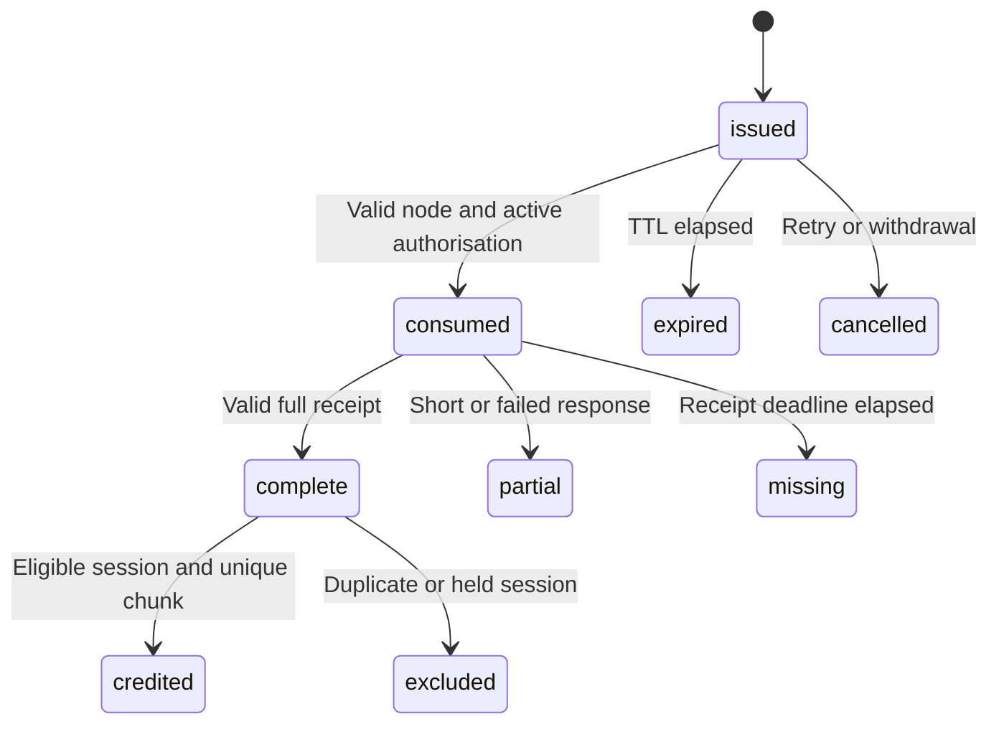

# London APPROVED: Data model, state machines and ledger

--- id: 11-data-model-and-event-schemas title: "Data model, state machines and ledger" sidebarposition: 12 --- APPROVED · IMPLEMENTATION SPECIFICATION · London 0.1.0 Persistence conventions Use UUIDv4 primary IDs, UTC timestamps and integer amounts. Numeric wire values larger than safe JavaScript integers are decimal strings. PostgreSQL numeric(20,0) holds unsigned u64 amounts; add nonnegative and maximum checks..

## Connected knowledge

No outgoing links.

## Source content

---
id: 11-data-model-and-event-schemas
title: "Data model, state machines and ledger"
sidebar_position: 12
---

**APPROVED · IMPLEMENTATION SPECIFICATION · London 0.1.0**

## Persistence conventions

Use UUIDv4 primary IDs, UTC timestamps and integer amounts. Numeric wire values larger than safe JavaScript integers are decimal strings. PostgreSQL `numeric(20,0)` holds unsigned u64 amounts; add nonnegative and maximum checks. Durations/times use checked integers. Never reuse an ID. Foreign keys and uniqueness are release requirements, not optional optimisations. Each material record stores schema version, creation timestamp, correlation ID and provenance where appropriate.

| Table | Required fields beyond ID | Constraints |
|---|---|---|
| accounts | provider_subject, roles, status | Unique provider/subject; no PII in chain IDs |
| subscription_periods | account, provider IDs, start/end, entitlement state, clearance, gross/net GBP | Unique provider period; end greater than start |
| works / rights_versions | catalogue metadata, licence reference, version, effective time, recipients | Unique work/version; splits sum 10000; append-only history |
| renditions / chunks | work, manifest hash, codec, duration; chunk index/media interval/size/hash | Unique rendition/index; complete ordered coverage |
| operators / nodes / node_keys | owner, independence declaration, endpoint, status, payout account, key intervals | One owner per node; approved endpoint; no overlapping active key versions |
| sessions | account, work, rendition, rights version, start/expiry/close, lease | Partial unique active account; lock for issuance |
| grants | session or fill destination, node, chunk, purpose, nonce hash, expiry, consume sequence/request/time, cancellation | Unique nonce; one consumption; monotonic coordinator sequence |
| receipts | receipt ID, grant, raw object/hash, signature, ingest time | Unique ID and one final receipt per consumed grant; conflicting body rejected |
| decisions | receipt/session, revision, disposition, reason, actor, predecessor | Append-only, one current projection; no raw input mutation |
| peer_fills | source/destination, grant, receipt hash, verified outcome | Never joins royalty-duration tables |
| funding_lots | verified deposit, asset, amount, conversion references | Unique deposit evidence; allocated total at most received |
| budgets | period, lot contributions, B, daily slices, unspent/reserved/allocated | Conserved; unique period funding version |
| allocation_lines | listener-day, work/rights, role, recipient snapshot, duration, amount, revision | No double allocation; linked reversal/replacement for corrections |
| batches | kind, period, artifact location/hash, parent/correction, chain state | Unique batch ID; immutable payload after freeze |
| statements | recipient, accounting batch, private artifact hash, public proof ID | Unique recipient/batch; public ID random and unlinkable across periods |
| payment_runs / payments | approved hash, approver, cap; recipient, amount, contribution set, state | Each payable contribution reserved once; no duplicate paid obligation |
| payment_attempts | payment, sender sequence, signed bytes/hash, expiry, outcome, ledger version | Unique sender/sequence and transaction hash; write before broadcast |
| exceptions / audit / outbox | target, actor, event, payload reference, timestamp | Append-only audit; unique event business key |

Database/application permissions prevent update/delete of raw receipts, frozen artifacts, posted monetary entries and audit events. Derived status tables can be rebuilt. Append-only here is an access-controlled database property; chain anchoring adds external tamper evidence. Backups and retained object versions provide availability.

## State machines

Receipt decisions: `recorded -> accepted | rejected | partial | late | held`. Releasing a hold appends a new decision revision. Eligibility is evaluated on the closed session, not the individual receipt alone. Grant state, receipt state and allocation state are separate columns; do not conflate them in one overloaded status.

Batch states: `preparing -> frozen -> submitted -> confirmed`, with `failed` retryable against the same payload and `uncertain` requiring reconciliation. A frozen batch may be abandoned before submission, retaining its ID and reason; never reuse that ID with different bytes. A confirmed batch has no editable-content state. Corrections are new batches.

Payment states: `prepared -> approved -> signed -> submitted -> confirmed`; branches `held`, `failed`, `uncertain`, `cancelled`. Cancel only before signing, or after proving a signed attempt cannot succeed. `confirmed` is terminal. Failure is per attempt; obligation remains unpaid until success or an authorised accounting correction closes it.

## Ledger conservation

Use explicit debit/credit postings per business event. Each journal balances in a single asset/currency; never mix GBP and USDC in one numeric balance. Track USDC funding availability, unallocated reserve, artist payables, operator payables, Porto retained share, reserved payouts and confirmed paid amounts. Reconcile chain treasury balances separately from economic attribution. Conversion links GBP and USDC journals through actual provider evidence, not an invented common unit.

Invariant for each funded budget: original funded units plus approved additions equal unallocated plus outstanding allocations plus paid allocations plus recorded refunds/reversals, with corrections represented exactly once. Reservations are a subdivision of unpaid allocations, not another expense. Ledger transitions and outbox events commit in one transaction. Run the invariant check after every accounting job and before signing; any mismatch blocks payouts.

## Audit events

Required event families: account/entitlement change; catalogue activation/withdrawal; operator admission/key change/suspension; session/grant issue/consume/cancel; receipt disposition; peer fill verification; hold change; funding import; day close; allocation freeze; commitment submission/confirmation; run approval; payment signed/submitted/confirmed/failed; export access; profile change. Store actor, target, payload digest, reason enum and timestamp. Detailed private notes use separate restricted references.

[Contents](index.mdx) · [Implementation plan](16-implementation-plan.md) · [Launch inputs](17-open-decisions-and-risk-register.md)
