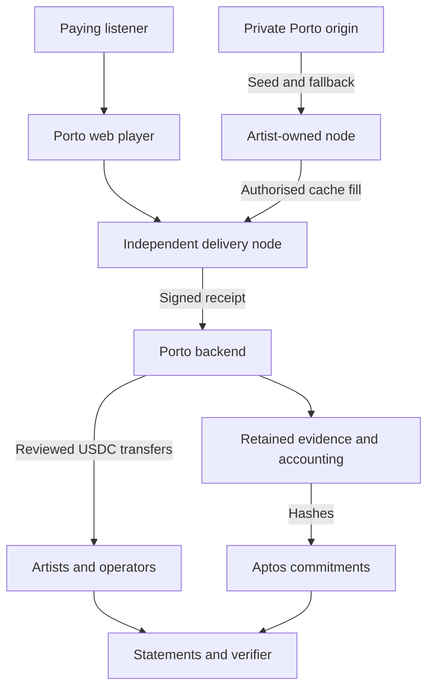

# London APPROVED: Executive architecture

--- id: 01-executive-architecture title: "Executive architecture" sidebarposition: 2 --- APPROVED · IMPLEMENTATION SPECIFICATION · London 0.1.0 Approved architecture London is a deliberately small music delivery and accounting network. Porto runs the catalogue, subscriptions, routing, accounting and payout coordination. Artists and other invited parties operate delivery nodes on infrastructure they control. Aptos.

## Connected knowledge

- describes: [[London Mainnet architecture (APPROVED)|London Mainnet architecture (APPROVED)]] (EXTRACTED)

## Source content

---
id: 01-executive-architecture
title: "Executive architecture"
sidebar_position: 2
---

**APPROVED · IMPLEMENTATION SPECIFICATION · London 0.1.0**

## Approved architecture

London is a deliberately small music delivery and accounting network. Porto runs the catalogue, subscriptions, routing, accounting and payout coordination. Artists and other invited parties operate delivery nodes on infrastructure they control. Aptos supplies the external ledger for commitments and USDC transfers.

The shortest complete story is: **pay, listen through a participant node, record, commit, allocate, pay artists and operators, verify**. One bounded peer cache transfer makes the infrastructure experiment concrete without requiring a public peer-discovery network.

## What this proves

| Question | Required observation | Boundary |
|---|---|---|
| Will listeners pay? | Cleared subscriptions, repeat listening, renewal offered and observed | Invitations or free plays alone do not establish paid demand |
| Can outsiders operate delivery? | Artist and unrelated-party nodes actually serve accepted sessions | Porto-operated machines with participant labels do not qualify |
| Does peer transfer work? | Node B retrieves verified chunks from A, then serves them | A gateway redirect or shared Porto bucket alone is insufficient |
| Does accounting work? | Independent recomputation conserves funds and matches statements | A displayed number alone is insufficient |
| Do payouts work? | Confirmed native USDC transfer to the agreed account | Accrual, submitted transaction and testnet transfer are different states |
| Can history be checked? | Original file matches chain hash; changed file fails; correction remains linked | A hash does not establish input truth or continued file availability |
| Is participation attractive? | Costs, effort, rewards and continuation decisions are recorded | Pilot subsidies must be separated from earned rewards |

## Deliberate trust

Porto controls grant issuance, receipt acceptance, routing and calculations. Operators can lie in signed receipts; collusion remains possible. The pilot mitigates obvious replay and unauthorised traffic, bounds money at risk and measures discrepancies. It does not claim trustless streaming. Independent review of frozen accounting inputs is required before payouts, but a separate attestation service is not.

Use this public description: “Porto's London pilot uses independently operated music delivery nodes, Porto-coordinated accounting, and Aptos Mainnet records and USDC payouts.” Describe the actual node-to-node demonstration separately. Do not claim permissionless operation, independent attestation or decentralised consensus.

## Smallest implementation

One web application; one modular backend plus workers; PostgreSQL; private origin and evidence object storage; one containerised node package; one append-only Move commitment module; one payment-provider adapter and one treasury conversion adapter. A CLI is sufficient for catalogue import, operator admission, holds, run approval and exports. Do not build an admin product merely to avoid a documented manual operation.

[Contents](index.mdx) · [Implementation plan](16-implementation-plan.md) · [Launch inputs](17-open-decisions-and-risk-register.md)
