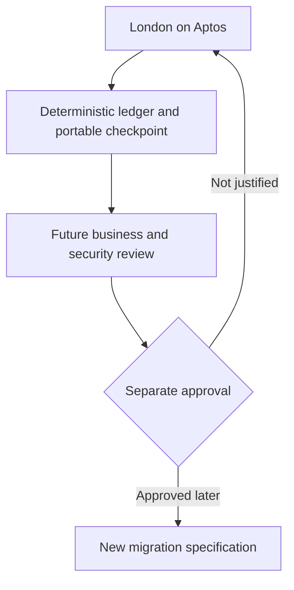

# London APPROVED: Future compatibility, no migration implementation

--- id: 15-migration-to-porto-app-chain title: "Future compatibility, no migration implementation" sidebarposition: 16 --- APPROVED · IMPLEMENTATION SPECIFICATION · London 0.1.0 Out of scope London does not build a Porto app-chain, bridge, validator stack, token, snapshot-claim contract or migration service. No delivery operator automatically becomes an attestor or validator. These are distinct responsibilities.

## Connected knowledge

- describes: [[London deterministic RocksDB ledger (APPROVED)|London deterministic RocksDB ledger (APPROVED)]] (EXTRACTED)

## Source content

---
id: 15-migration-to-porto-app-chain
title: "Future compatibility, no migration implementation"
sidebar_position: 16
---

**APPROVED · IMPLEMENTATION SPECIFICATION · London 0.1.0**

## Out of scope

London does not build a Porto app-chain, bridge, validator stack, token, snapshot-claim contract or migration service. No delivery operator automatically becomes an attestor or validator. These are distinct responsibilities requiring a later approved specification.

The earlier broad draft's migration programme is replaced by a small portability contract: stable internal IDs, explicit chain/package/asset references, exportable evidence and accounting, versioned schemas and no assumptions that a single chain address is a universal identity.

## Deterministic ledger as the migration boundary

London now builds the RocksDB ledger, pure state-transition functions, canonical command journal, deterministic replay and portable checkpoint format as its first milestone. A later sovereign chain could replace Porto command ordering with consensus while preserving compatible domain rules. PostgreSQL is no longer the authoritative-store choice for London.

The reusable contract is logical state and execution semantics. Shared use of RocksDB does not guarantee identical storage layout, code reuse in a Move VM, consensus safety or an asset bridge. The future migration must choose which state is replicated, preserve private data boundaries and test a deterministic conversion if the target runtime differs. Required now: export/import and replay in a clean local engine with matching digests. Deferred: actual genesis admission, consensus integration, validator operation and live chain cutover.

## Preserve only useful boundaries

Every payment and commitment records chain ID, package where relevant, asset metadata and ledger position. Never rewrite an old record to look as if it occurred on a new chain. Keep past Aptos commitments and transfer links verifiable. Export unsettled obligations, source contributions, holds and signed/uncertain attempts independently from UI state. Payout addressing is a recipient version with chain identity, not a string assumed to work everywhere.

A future specification must reconcile every unpaid obligation, resolve uncertain transfers, define any challenge/claims process and establish asset support/custody on the destination. Aptos USDC does not automatically become available on another chain. Do not build bridge placeholders that imply a provider commitment.

## Evidence that could justify later work

Use actual operator participation, serving reliability, infrastructure cost, payment volume, commitment cost and governance/security capacity. London stores those measurements; it does not set a fabricated migration date or promise migration as the reward for participating. The current implementation is complete when this release's acceptance criteria pass, without any executable migration component.

[Contents](index.mdx) · [Implementation plan](16-implementation-plan.md) · [Launch inputs](17-open-decisions-and-risk-register.md)
