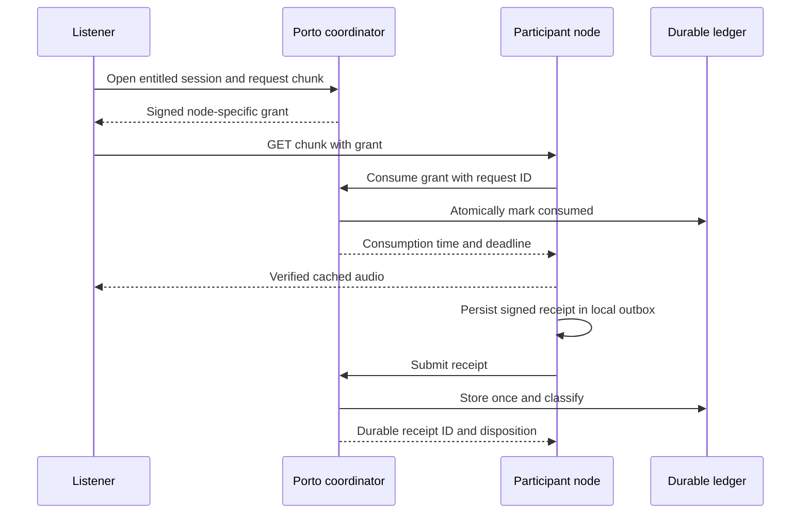
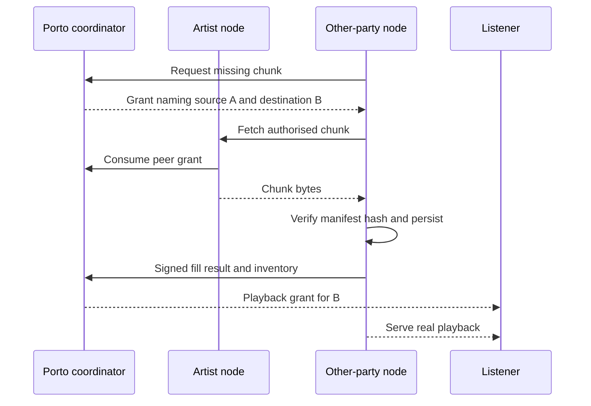

# London APPROVED: Playback, peer delivery and usage evidence

--- id: 06-streaming-delivery-and-attestation title: "Playback, peer delivery and usage evidence" sidebarposition: 7 --- APPROVED · IMPLEMENTATION SPECIFICATION · London 0.1.0 Playback authorisation The coordinator checks authenticated entitlement, territory, active work/rights and one active session per listener. A second session request returns 409 ACTIVESESSION; the listener may explicitly close the old session.

## Connected knowledge

- describes: [[London delivery evidence (APPROVED)|London delivery evidence (APPROVED)]] (EXTRACTED)

## Source content

---
id: 06-streaming-delivery-and-attestation
title: "Playback, peer delivery and usage evidence"
sidebar_position: 7
---

**APPROVED · IMPLEMENTATION SPECIFICATION · London 0.1.0**

## Playback authorisation

The coordinator checks authenticated entitlement, territory, active work/rights and one active session per listener. A second session request returns 409 `ACTIVE_SESSION`; the listener may explicitly close the old session first. Sessions expire after two minutes without grant activity, after six hours, at entitlement expiry or at rights/availability boundary, whichever comes first. No browser heartbeat creates monetary evidence.

A grant names one session, one rendition/chunk, one selected node, a random 256-bit nonce, issue/expiry timestamps, and purpose `playback`. TTL is 60 seconds. The node verifies the gateway signature, then calls atomic grant consumption before sending bytes. Consumption requires the matching node credential, active session, current entitlement/availability and unused/unexpired grant. Same grant and same request ID returns the original consume result; a different request ID returns 409. The node must also locally reject a second HTTP stream for the same consumed request, including after restart. Consumed grants cannot be reused to serve bytes.

The gateway allows at most five media chunks (ten seconds) of prefetch credit. Start with ten seconds; replenish at real elapsed time up to that cap; deduct each newly issued chunk's full duration. Retry of the same chunk does not deduct again. Track issuance against the listener session using a database lock. Limit grant issuance to 120/minute/session and session creation to ten/minute/account. Seeking does not reset prefetch credit. No parallel sessions or new-session churn may reset the listener-wide ten-second credit bucket.

## Duration and eligibility

A receipt reports bytes actually written, HTTP outcome and the manifest chunk digest. A complete chunk requires exact declared byte length, successful response, matching consumed grant and receipt arrival within ten minutes of consumption. Transfer ends within 30 seconds of consume time. Require node times within two seconds of coordinator time at the start and ordered start/end inside the allowed interval; clock failures reject the timing claim and remove the node from routing until corrected. The coordinator ingest cutoff and consume sequence remain authoritative; signed node clocks are not independent proof of completion time. Partial/error/cancelled deliveries earn zero unless a complete valid response finished before cancellation. Receipts are assertions, not proof of attention. On-time complete receipts may close an already expired session; expiry prevents further grants, not receipt processing.

Credit each `(session_id, chunk_index)` once across all nodes and retries. Pick the valid complete receipt with lowest coordinator-assigned consume sequence; tie by receipt ID. Never use untrusted node clock to break ties. Repeated playback of the same chunk in one session earns zero additional credit. Different complete chunks contribute their manifest duration. A session becomes eligible at `min(30000, floor(work_duration_ms/2))` served milliseconds; all its unique complete chunks then contribute, including those preceding the threshold. Below-threshold sessions remain recorded but receive zero allocation. The init segment always contributes zero.

Associate a chunk with the UTC day containing coordinator consume time. Sessions close at UTC midnight, so daily attribution and eligibility are unambiguous; the player silently opens a new session and continues. At day D + 00:10, all preceding-day receipts reach their cutoff. Late receipts are retained as late, never silently inserted in a frozen batch. A support correction can link a supplementary artifact, but cannot rewrite paid history. A session also closes on explicit stop, work change, timeout or failure.

## Peer cache fill, required pilot path

Porto selects an active source node with verified inventory, and issues purpose `peer_fill` grants bound to source node, destination node and one chunk/init segment. The destination authenticates to Porto with its own credential, receives the signed grant and makes HTTPS GET to the source. The source atomically consumes it using its own node identity. The destination verifies content against the signed manifest before admitting it to cache, and submits a signed fill result linking both node IDs, grant, digest, size and outcome. TTL is 60 seconds; transfer deadline 30 seconds; at most four concurrent fills per destination. Refresh grants for further chunks, never issue whole-bucket access.

A failed peer fill retries once, then uses Porto origin via a new scoped grant. Record the source transition. Peer fills, warming, probes and test traffic are excluded from listening and operator reward duration. Retain them as infrastructure metrics only. Serving cached content to eligible real playback earns the same rate regardless of whether origin or a peer supplied the cache.

## Receipt to batch

The same backend validates receipt schema, signature/key interval, grant purpose/consumption, byte count, timing and duplicate identity. Store raw signed input plus a separate decision record. Missing receipts and held sessions remain visible in the daily inventory. Evidence preparation freezes accepted, rejected, partial, late and missing dispositions rather than hiding failures. The approved eligible subset alone feeds accounting.

No separate attestation service or fraud-review product is required. The term “attested” may describe a Porto acceptance decision only when its centralised trust is explicit. Prefer “recorded”, “eligible” and “committed” in the UI.

[Contents](index.mdx) · [Implementation plan](16-implementation-plan.md) · [Launch inputs](17-open-decisions-and-risk-register.md)
