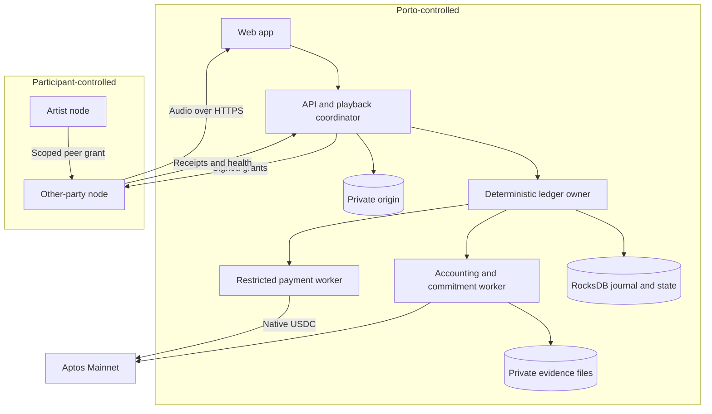

# London APPROVED: System architecture and ownership

--- id: 02-system-architecture title: "System architecture and ownership" sidebarposition: 3 --- APPROVED · IMPLEMENTATION SPECIFICATION · London 0.1.0 Deployment boundaries The web application calls Porto over HTTPS. Porto owns a modular API and job worker codebase, a deterministic RocksDB ledger, private S3 origin in London, and separately permissioned evidence storage. Each participant owns its node host, local.

## Connected knowledge

No outgoing links.

## Source content

---
id: 02-system-architecture
title: "System architecture and ownership"
sidebar_position: 3
---

**APPROVED · IMPLEMENTATION SPECIFICATION · London 0.1.0**

## Deployment boundaries

The web application calls Porto over HTTPS. Porto owns a modular API and job worker codebase, a deterministic RocksDB ledger, private S3 origin in London, and separately permissioned evidence storage. Each participant owns its node host, local cache, node key and outbound connectivity. Porto holds no operator hosting credentials. Operators receive no origin-bucket credentials, listener identity, payment information or treasury key.

Use one writable RocksDB TransactionDB owned by the backend ledger module, a serial command executor and an atomic journal/state/outbox commit. All workers access typed commands and queries through the owner; no worker opens database files. The exact ownership, key encoding, durability, replay and checkpoint contract is in [the ledger specification](27-deterministic-rocksdb-ledger.md). Run the payment signer as a separately permissioned worker from the same codebase. It alone can request payout signatures. Node software is a container with persistent cache and receipt spool volumes. Pin image digests; do not require Kubernetes, a service mesh or a distributed queue for this pilot. Language/framework choices are implementation ADRs; they must preserve these contracts and may not change product scope.

## Module responsibilities

| Module | Owns | Must not do |
|---|---|---|
| Identity and billing | Verified provider events, entitlement, subscription periods | Treat checkout redirects as payment confirmation |
| Catalogue | Licences, rights snapshots, content manifests | Rewrite a rendition under an existing hash |
| Coordinator | Session lease, route, grants, atomic grant consumption | Trust browser duration for accounting |
| Evidence | Receipt ingest, validation decisions, object retention | Overwrite accepted receipts or closed batches |
| Accounting | Budget lots, allocation lines, holds, statements | Allocate more than funded and unspent budgets |
| Commitment worker | Canonical artifacts and append transactions | Hold or transfer USDC |
| Payment worker | Approved payment intent, signing, submission, reconciliation | Select recipients or amounts after approval |
| Read model | Status and authorised exports | Mark a payment paid from a submission response |
| Node | Verified cache, scoped serving, receipt spool | Issue playback grants or independently award rewards |

## Routing and failure boundaries

Only active nodes with a heartbeat within 60 seconds and a complete verified requested chunk are candidates. Exclude nodes failing three consecutive probes, suspended nodes and nodes already failed for that grant attempt. Sort candidates by node ID; choose `SHA256(session_id || chunk_index)` interpreted as unsigned big-endian modulo candidate count. This deterministic pilot rule spreads traffic without introducing a scheduling market. Record candidates, selection and fallback reason for the experiment.

The browser allows three seconds for first byte, then cancels and requests one retry grant with the prior grant ID. The coordinator marks the old grant cancelled, chooses another node or Porto origin fallback and issues a fresh grant. A response can race cancellation; [receipt rules](06-streaming-delivery-and-attestation.md) determine credit once. At most two participant attempts per chunk, then one origin attempt. An origin failure surfaces a recoverable playback error, not an endless retry loop.

A control-plane outage prevents new grants and consumption. Already consumed grants may finish within their 30-second transfer deadline. Chain/provider outages must not erase usage; the backend can continue entitled playback while separately showing delayed anchoring/accounting/payment. Insufficient durable evidence capacity disables new serving rather than silently losing payable records.

## Repository delivery contract

Implement the production system in a separately approved application checkout. This documentation task writes no production application or Move implementation. Required future directories are logical, not instructions to overwrite an existing repository: `apps/web`, `apps/api`, `workers`, `node`, `contracts/commitments`, `packages/contracts`, `tools/verifier`, `tests/fixtures`, `ops`. Existing equivalent structure may be retained. Shared schemas and golden fixtures must have one source of truth.

[Contents](index.mdx) · [Implementation plan](16-implementation-plan.md) · [Launch inputs](17-open-decisions-and-risk-register.md)
