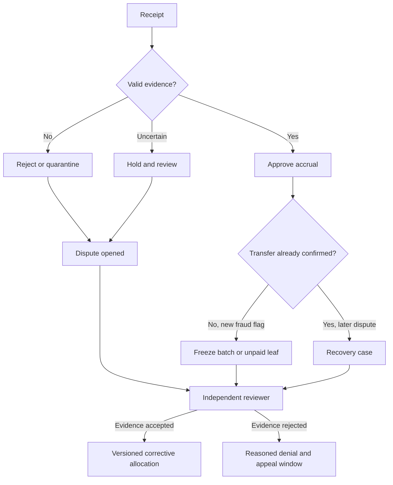

# London DRAFT: Fraud controls and disputes

--- id: 07-fraud-controls-and-disputes title: "Fraud controls and disputes" sidebarposition: 8 --- DRAFT · PROPOSED · IMPLEMENTATION SPECIFICATION Decision pipeline Validate schema/signature, operator/key validity interval, grant consumption, lease generation, catalogue version, chunk digest, successful bytes and uniqueness before scoring. Invalid cryptographic or integrity evidence is rejected. Missing.

## Connected knowledge

No outgoing links.

## Source content

---
id: 07-fraud-controls-and-disputes
title: "Fraud controls and disputes"
sidebar_position: 8
---

**DRAFT · PROPOSED · IMPLEMENTATION SPECIFICATION**

## Decision pipeline

Validate schema/signature, operator/key validity interval, grant consumption, lease generation, catalogue version, chunk digest, successful bytes and uniqueness before scoring. Invalid cryptographic or integrity evidence is rejected. Missing corroboration, abnormal rates or ambiguous provider state is held. Only `approved` contributes to accrual. Record deterministic rule hits, policy hash, input digest, reviewer and decision revision. New policy versions apply prospectively; re-review requires a linked revision, never mutation.

| Control | Proposed configurable default | Action |
|---|---|---|
| Active account leases | 1 | Reject second session unless takeover |
| Account session issuance | 10/minute | HTTP 429, then review sustained abuse |
| Credited duration per account/day | 86,400,000 ms | Hold excess, respect interval overlap |
| Same account/work eligible sessions | 20/day | Hold excess for review |
| Granted prebuffer | 10 seconds | Deny excess range grants |
| Receipt replay | Zero duplicate contribution | Return original receipt, reject changed payload |
| Operator bad-signature or integrity failure | Any | Quarantine receipt, integrity failure suspends route immediately |
| Abnormal node accepted-duration change | Greater than 3x trailing 7-day median, minimum 100 sessions | Hold new rewards and manual review; cold-start always capped |
| Review age | 48 hours | Escalate, never auto-approve |

Thresholds are hypotheses for testing, not measured fraud accuracy. IP/device signals can support investigation but never prove identity, guilt or settlement duration. Review shared networks and accessibility usage before permanent sanctions. Cold-start operator daily monetary caps and account creation/payment friction are D09/D11 launch configuration, not unlimited defaults.

## Holds, disputes and corrections

Case lifecycle: `open -> investigating -> awaiting_evidence -> upheld|rejected -> appeal -> closed`; appeal can return to investigating with a different reviewer. Proposed submission window is 30 days from statement, response target two business days, resolution target ten business days. These are proposed operating targets and D08/D09 terms, not statutory limits; mandatory rights take precedence after legal review.

Before on-chain publication, a held listener-day allocation remains reserved internally; freeze the entire listener-day if unresolved evidence could change its denominator. Do not redistribute held time to other works. After publication pause the affected batch immediately, then mark disputed unpaid leaves held. Cancel/reissue only unpaid leaves with an immutable supersession link and finance approval. Paid transfers cannot be undone. A recovery creates a separate receivable or voluntary return transaction; future offset requires contract/legal authority, disclosure and review. Never create negative on-chain payments or claw back unrelated recipients.

Operator lifecycle: `pending -> active -> suspended -> probation -> active|removed`. Suspension time and compromised-key interval are recorded. Reinstatement needs resolved incident, new key if needed, successful probes and independent approval. Retain original signed evidence and appeals.

## ZK boundary

ZK can demonstrate execution of a defined computation over committed inputs. It does not make fabricated delivery inputs truthful. MVP priorities are input provenance, access control, independent review and bounded funds. `OUT OF SCOPE`: a launch ZK system. Optional research can evaluate private allocation proofs against fixed inputs and independently measured costs after the input trust problem is addressed.

[London 0.1.0 contents](index.mdx) · [Decision register](17-open-decisions-and-risk-register.md)
