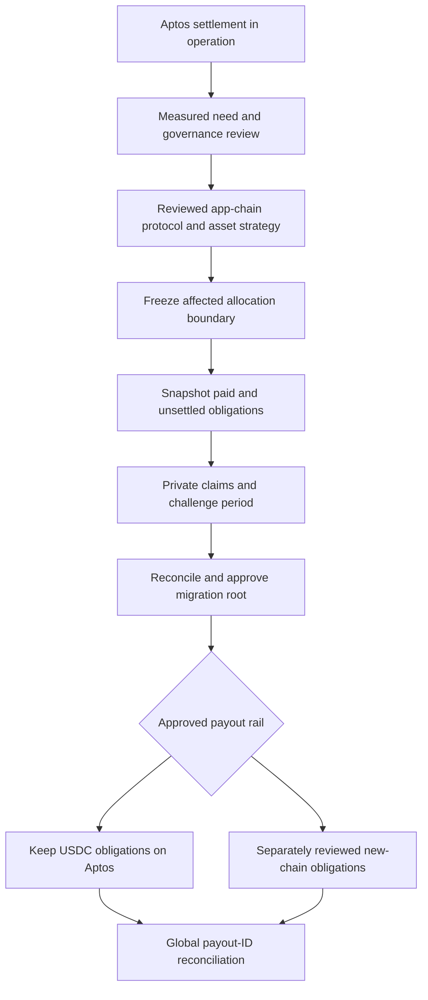

# London DRAFT: Future Porto app-chain migration

--- id: 15-migration-to-porto-app-chain title: "Future Porto app-chain migration" sidebarposition: 16 --- DRAFT · PROPOSED · IMPLEMENTATION SPECIFICATION Future work, not a launch promise Stable content/work/operator/payout IDs, versioned evidence schemas, immutable allocation manifests and a chain adapter isolate Aptos-specific transaction construction. Chain adapters must expose submit, lookupbybusinessid,.

## Connected knowledge

No outgoing links.

## Source content

---
id: 15-migration-to-porto-app-chain
title: "Future Porto app-chain migration"
sidebar_position: 16
---

**DRAFT · PROPOSED · IMPLEMENTATION SPECIFICATION**

## Future work, not a launch promise

Stable content/work/operator/payout IDs, versioned evidence schemas, immutable allocation manifests and a chain adapter isolate Aptos-specific transaction construction. Chain adapters must expose `submit`, `lookup_by_business_id`, `read_committed_result`, `asset_identity` and `ledger_cursor`; they cannot hide changes in finality or custody assumptions. Account address is a rail-specific binding, not the canonical recipient ID.

No launch code should presume PRT, a bridge or Porto validators exist. Delivery operators can first become independent evidence attestors after a separately reviewed protocol for independent observation, quorum disagreement and incentives. Serving the same bytes twice is not automatically independent evidence of one listener's session. Later validator participation needs separate consensus security, stake distribution, hardware, key custody and economic review. Operator admission alone confers none of these roles.

## Migration gates

A future decision must compare measured sustained volume, transaction costs and latency with Aptos alternatives; independent operator participation and geographic/custody concentration; economic volume sufficient to fund security; audit/fuzzing maturity; validator incident capacity; custody/asset access and governance readiness. Numeric thresholds are deliberately unset future governance decisions. Passing commercial targets alone cannot replace security proof.

## Cutover protocol

Choose an epoch boundary and pause new obligations in the migrating cohort. Reconcile every Aptos paid leaf from chain, cancel or finish outstanding transactions, snapshot funded-but-unsettled, committed-unpaid, disputed, unallocated and reserve balances separately. Sign hashes and total by asset and custody account. Never snapshot submitted transactions as paid or ignore an ambiguous in-flight transfer.

Provide recipients a private statement and inclusion proof; publish only aggregate commitments. Proposed future challenge period is 30 days, subject to legal/governance ratification. Resolve claims with evidence, freeze disputed lines, produce a new versioned approved root. Preserve all old snapshot versions. Migration uniqueness ledger maps each global payout ID to exactly one active rail; lock the source obligation before enabling destination claim. Test simultaneous source/destination claims and uncertain source confirmations.

USDC already paid on Aptos remains with its recipient. USDC held by Porto on Aptos remains there until a separately approved action; copying a ledger entry does not move an asset. Default migration keeps Aptos USDC liabilities payable on Aptos while new-chain accounting develops. Bridging, issuer support, new asset denomination or redemption on a Porto chain require new security/provider/legal decisions; no automatic issuer support is assumed.

Before cutover, rollback can unfreeze the unchanged Aptos path. After destination obligations become payable, rollback must reconcile claims on both rails and lock spent IDs; never re-enable the original payout blindly. Keep portable audit data and read-only historical APIs. `CURRENT SOURCE`: whitepaper §§4,6.5,9, PIP-4 §8 and PIP-7 §4 describe future decentralisation intent, not this migration mechanism.

[London 0.1.0 contents](index.mdx) · [Decision register](17-open-decisions-and-risk-register.md)
