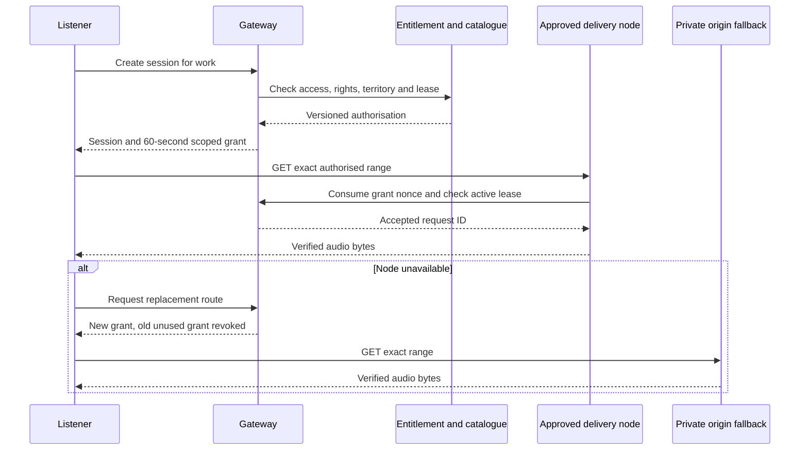
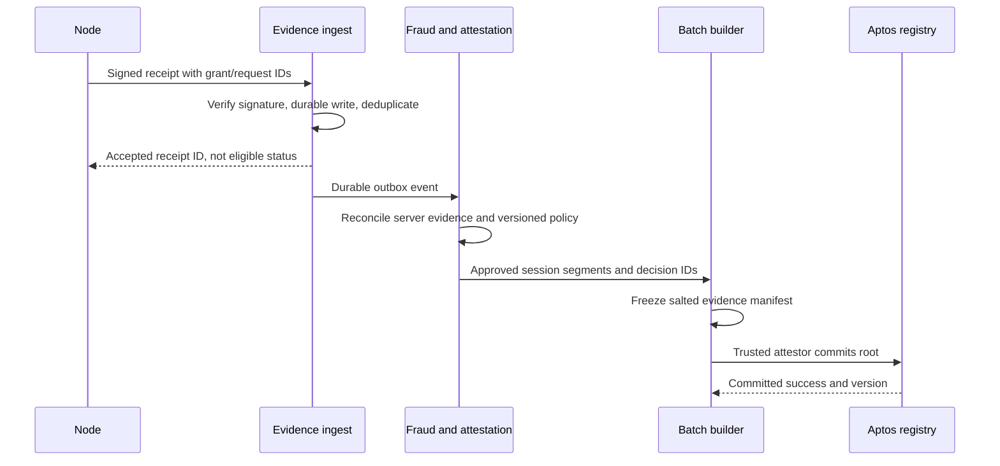

# London DRAFT: Streaming, delivery and attestation

--- id: 06-streaming-delivery-and-attestation title: "Streaming, delivery and attestation" sidebarposition: 7 --- DRAFT · PROPOSED · IMPLEMENTATION SPECIFICATION Playback authorisation Use gateway-signed range URLs to Porto-controlled serving endpoints, not direct client S3 URLs. Claims include schemaversion, keyid, sessionid, grantid, random 256-bit nonce, work/rendition/rights version, exact byte interval,.

## Connected knowledge

- describes: [[London delivery evidence (DRAFT)|London delivery evidence (DRAFT)]] (EXTRACTED)

## Source content

---
id: 06-streaming-delivery-and-attestation
title: "Streaming, delivery and attestation"
sidebar_position: 7
---

**DRAFT · PROPOSED · IMPLEMENTATION SPECIFICATION**

## Playback authorisation

Use gateway-signed range URLs to Porto-controlled serving endpoints, not direct client S3 URLs. Claims include `schema_version`, `key_id`, `session_id`, `grant_id`, random 256-bit nonce, work/rendition/rights version, exact byte interval, assigned operator, audience, issued/expiry time and lease generation. Ed25519 signature covers canonical bytes specified in [wire contracts](21-wire-and-commitment-contracts.md). Server validates every field, atomically consumes the nonce at request start and persists a request ID. Expired, wrong-node, wrong-range or revoked grants fail closed. Retries request a fresh grant and never double-count media.

Grant TTL is 60 seconds; session idle expiry 120 seconds; maximum session lifetime 6 hours. Refresh uses an authenticated account session and exclusive lease. A grant permits at most 10 seconds of media; rolling unique media authorised cannot exceed session wall-clock elapsed plus a 10-second prebuffer. Server clocks supply elapsed time; at most 5-second clock skew is accepted. This bounds bulk prefetch, but cannot prove attention. All these are proposed configurable defaults requiring launch ratification.

A server-to-server S3 presigned URL may retrieve a pinned object version into an admitted cache, with credentials scoped to exact objects. Never expose S3 listing or write permission to operators. S3 Block Public Access, private policies, encryption, access audit and versioning are mandatory. Evidence and masters use separate buckets and keys.

`CURRENT SOURCE`: [AWS presigned URL guidance](https://docs.aws.amazon.com/AmazonS3/latest/userguide/using-presigned-url.html) says presigned URLs are reusable until expiry. They are bearer capabilities. Porto session binding and nonce consumption therefore require the serving layer above S3. No claim of native S3 one-time access is made.

## Duration and eligibility

The server records actual response bytes written, status, request interval and verified chunk digest. A successful socket write proves only server-observed delivery, not remote decoding or attention. A node's signed statement is an assertion Porto must validate. Do not describe it as independent proof.

Normalize evidence to completed manifest chunks; deduplicate the union of media intervals per `(listener_internal_id, work_id, session_id)` across ranges, retries and operators. A payable chunk must be completely evidenced by one operator, possibly across that operator's contiguous retries. Do not combine partial delivery by different operators into a payable chunk. Attribute each chunk to the first operator completing it, ordered by the gateway request sequence that completed coverage; duplicates earn zero. A fallback can re-serve the complete chunk if no operator completed it. Reject impossible clock intervals and unauthorised chunks. Cap total credited duration by elapsed authorised lease time plus prebuffer, work duration and approved daily account/work limits. Overlapping sessions cannot increase the account's elapsed-time ceiling.

A session is eligible when approved unique duration reaches `min(30000, floor(work_duration_ms / 2))`, with positive registered duration. If it qualifies, credit its approved unique duration, including the initial threshold interval; if it does not, credit zero. Client playheads/heartbeats affect UX only. Repeated media within a session earns zero additional duration. A new session can qualify again only within the policy's account/work daily cap.

A session crossing midnight is evaluated once at closure; qualifying duration is partitioned by server delivery time across UTC service days and rights versions. No daily slice is published until the session closes or expires. A six-hour session can therefore delay its prior-day inputs, covered by the close watermark below.

## Receipt to batch

Receipt arrival deadline is 24 hours after service-day end. Day D freezes at D+2 00:00 UTC, once maximum session age, receipt deadline and queue reconciliation have elapsed. Runs are daily, with this explicit delay. Late evidence enters review; accepted late evidence requires an adjustment against remaining funded budgets, never rewriting a closed root. No batch may contain unresolved sessions. Batch transport target is 60 seconds or 500 closed-session records, distinct from daily economic finalisation. Split transactions to measured chain limits; these targets are not claimed capacity.

## Evidence custody

Encrypted raw receipts and signed manifests are immutable with content hashes and retention locks compatible with the approved retention policy. Proposed retention: raw IP/operational access logs 30 days, pseudonymised evidence 180 days, financial/audit records 7 years, subject to D08 professional review before production. Separate identity mappings and destroy them at approved expiry unless under documented legal hold. Never put raw evidence or unsalted listener hashes on-chain. Authorised dispute export includes relevant receipts, grant lineage, hash manifest, policy and allocation versions, with listener identifiers redacted. Access is logged and expires after 15 minutes. A retention lock must not be enabled before legal/privacy review of duration and erasure handling.

See [glossary](glossary.md) for exact state meanings. `CURRENT SOURCE`: PIP-4 §§2,3,5 supplies threshold, server-evidence intent and batching context; London changes the byte accounting, schema and trust boundary.

[London 0.1.0 contents](index.mdx) · [Decision register](17-open-decisions-and-risk-register.md)
