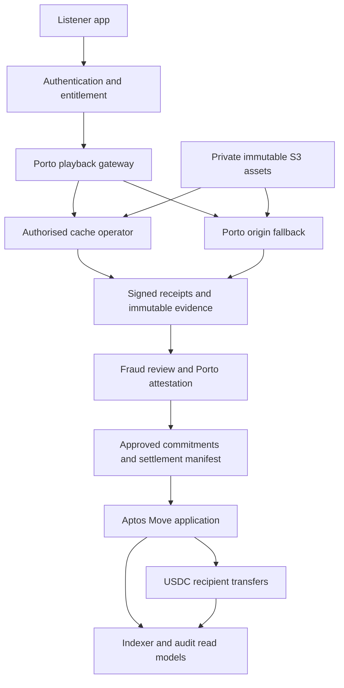

# London DRAFT: System architecture

--- id: 02-system-architecture title: "System architecture" sidebarposition: 3 --- DRAFT · PROPOSED · IMPLEMENTATION SPECIFICATION Components and durable boundaries Component Owns Failure behaviour --------- Auth/entitlement Identity session, subscription access interval Deny new playback if authoritative state unavailable Catalogue Rights version, territory, asset manifest Deny unknown or withdrawn work Gateway.

## Connected knowledge

No outgoing links.

## Source content

---
id: 02-system-architecture
title: "System architecture"
sidebar_position: 3
---

**DRAFT · PROPOSED · IMPLEMENTATION SPECIFICATION**

## Components and durable boundaries

| Component | Owns | Failure behaviour |
|---|---|---|
| Auth/entitlement | Identity session, subscription access interval | Deny new playback if authoritative state unavailable |
| Catalogue | Rights version, territory, asset manifest | Deny unknown or withdrawn work |
| Gateway | Session nonce, concurrency lease, routing | Fail closed for authorisation; origin fallback for serving |
| Delivery service | Verified cached chunks, signed receipts | Missing/invalid evidence earns nothing |
| Evidence store | Encrypted append-only originals and receipt index | Persist before acknowledgement; spool bounded evidence or stop rewarded serving |
| Attestation | Policy-versioned validation and review | Hold uncertain evidence, never guess duration |
| Treasury ledger | Provider reconciliation and funded budgets | Do not allocate unconfirmed money |
| Settlement builder | Deterministic immutable allocation manifest | Independent recomputation required before release |
| Move application | Registry snapshots, budget reservation, transfer uniqueness | Abort atomically; no partial transaction success |
| Indexer | Cursor-based on-chain projection | Show last verified ledger version and stale flag |

Use PostgreSQL transactions for session leases, receipt uniqueness and ledger postings; a transactional outbox publishes committed changes. Queue delivery is at least once. Consumers keep event-id inboxes. Acknowledge receipt ingestion only after immutable object persistence and transactional index/outbox commit; incomplete writes are reconciled by content digest. No distributed exactly-once claim is made.

Separate identity/payment, delivery/evidence, finance, and public read-model stores with distinct service identities. No serving key may transfer treasury funds. Two independent authenticated RPC sources must agree on chain identity and committed transaction results before financial reconciliation accepts a payout; disagreement causes a hold.

`ASSUMPTION`: initial region is London, `eu-west-2`, with multi-AZ compute and managed regional S3. Region selection and DR destination require privacy and operations approval. S3 is regional storage; do not assume a bucket belongs to a selected compute availability zone. `CURRENT SOURCE`: PIP-4 §1 and whitepaper §6.2 establish the private London-origin intent, not an implemented topology.

[London 0.1.0 contents](index.mdx) · [Decision register](17-open-decisions-and-risk-register.md)
