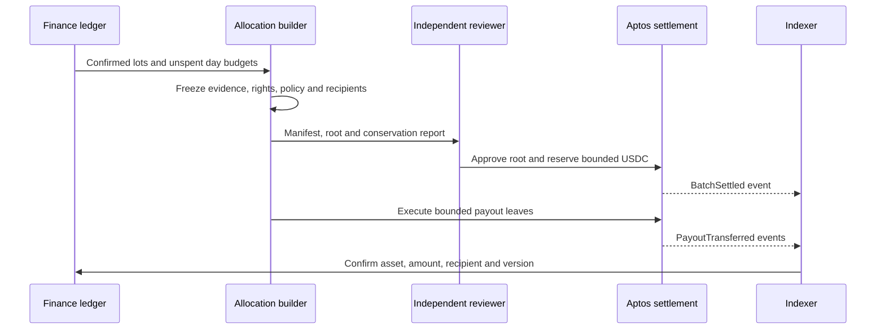
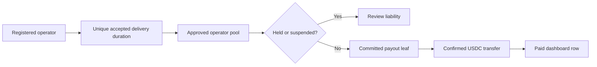

# London DRAFT: USDC treasury and settlement

--- id: 08-usdc-treasury-and-settlement title: "USDC treasury and settlement" sidebarposition: 9 --- DRAFT · PROPOSED · IMPLEMENTATION SPECIFICATION Money states and ownership Each arrow requires an append-only ledger event, evidence reference, unique business ID and authorised actor. Exceptions branch from every state to held, failed, refundpending, reversalrecorded or recoveryopen; they never erase history..

## Connected knowledge

- describes: [[London USDC settlement (DRAFT)|London USDC settlement (DRAFT)]] (EXTRACTED)

## Source content

---
id: 08-usdc-treasury-and-settlement
title: "USDC treasury and settlement"
sidebar_position: 9
---

**DRAFT · PROPOSED · IMPLEMENTATION SPECIFICATION**

## Money states and ownership

```text
payment_authorised -> payment_cleared -> net_revenue_available
-> conversion_instructed -> treasury_usdc_confirmed -> listener_period_allocated
-> rights_and_operator_accrued -> onchain_settled -> payout_confirmed
```

Each arrow requires an append-only ledger event, evidence reference, unique business ID and authorised actor. Exceptions branch from every state to `held`, `failed`, `refund_pending`, `reversal_recorded` or `recovery_open`; they never erase history. Payment authorisation is not clearance. Clearance does not eliminate chargeback risk. A conversion quote or broadcast transaction is not a confirmed USDC balance.

Porto owns the treasury funds before settlement. Listener allocations are internal attribution budgets, not customer assets, wallets or redeemable crypto balances. Revenue recognition and liability treatment are D01/D04 professional decisions. This document does not decide their legal or accounting character.

## Fiat and conversion ledger

Record GBP minor units for gross receipts, VAT treatment, processor fee, refunds, chargebacks, reserve withheld/released and net available revenue. Do not assume a tax rate, exemption, fee or reserve percentage. A versioned approved accounting policy specifies whether each deduction reduces allocation or Porto's own margin. Never deduct an item twice.

For each conversion lot record provider instruction/reference, GBP debit, actual FX execution rate, explicit fees, USDC expected/received, destination, chain identity, transaction/version and accounting timestamps. Reconcile provider statement, bank movement and on-chain receipt. Short receipt, wrong asset/network, expired quote or unknown execution holds the lot. Query the provider by immutable idempotency key before retrying an ambiguous instruction. No automated trade or provider call is implemented by this specification.

Native Aptos USDC is fixed to reduce asset, reconciliation and smart-contract surface. An asset symbol is not sufficient. Pin the issuer's native asset metadata identity and chain in deployment configuration, verify decimals and transfer behaviour in rehearsal, reject bridged/lookalike assets. [Circle's contract registry](https://developers.circle.com/stablecoins/usdc-contract-addresses) lists the Aptos Mainnet address `0xbae207659db88bea0cbead6da0ed00aac12edcdda169e591cd41c94180b46f3b`. Reverify at deployment; this is not a Porto deployment address or provider commitment. Amounts in this specification use integer micro-USDC, subject to that metadata verification gate.

Provider capabilities required: GBP business funding, supported jurisdiction/entity, documented native Aptos USDC withdrawal, signed callbacks plus queryable statements, immutable references, duplicate protection, execution/fee visibility, sanctions and financial-crime processes, redemption/off-ramp terms, outage and recovery procedures. No provider is selected and no eligibility is assumed.

## Funded allocation algorithm

D05 must ratify the following proposed method or replace it before production. Let a listener subscription service interval be `[start_ms,end_ms)`. Once its attributable conversion lots are confirmed, assign an immutable integer budget `B` micro-USDC. Allocate B over overlapping UTC days in proportion to service milliseconds, using largest remainder, ties by ascending UTC day. The sum of daily budgets is exactly B. This avoids spending the monthly budget each day. Days before clearance accumulate evidence but cannot settle until funded. A conversion spanning subscriptions uses the same largest-remainder method weighted by approved net GBP, with ties by subscription ID.

After D's evidence watermark, freeze the whole listener-day if any relevant dispute is unresolved. For an unheld day, let `d_w` be accepted unique served duration by work and rights version and `T=sum(d_w)`. If T is zero, leave the day's budget unallocated in a separately tracked reserve; do not silently route it to treasury. D05 must approve eventual unused-budget disposition. Otherwise distribute the day budget in proportion to `d_w` using largest remainder and ties by `(work_id,rights_version)` ascending bytes.

Split each work allocation by ratified rights/operator/treasury basis points summing to 10000, again by largest remainder with tie order rights, operator, treasury. Within rights pool use snapshotted recipient basis points, ties by opaque recipient ID. Within operator pool use accepted unique duration attributed to each serving operator, ties by operator ID. Porto origin fallback uses a separately disclosed operator ID and reward recipient if D06 approves; otherwise hold its operator share pending policy, never redistribute it silently. Rights holders who also operate nodes get two distinct accounting lines.

Aggregate payout lines only after preserving per-listener attribution in the private ledger. Build stable payout IDs and a manifest whose total equals the sum of included unspent budgets. Do not perform monetary arithmetic in floats. Use checked u128 intermediates and checked u64 outputs. Negative adjustments are separate off-chain liabilities.

Synthetic test vector, not approved economics: B=101, two equal days produce 51 and 50. On day one, work durations 1:2 produce 17 and 34. With a test-only 6000/3000/1000 split, 17 produces 10/5/2. All sums conserve exactly. Never use this fixture as production configuration. Existing 70/25/5 is also not pre-approved for London.

## Daily settlement and operator rewards





`onchain_settled` means the obligation root and bounded funds reservation committed successfully. `payout_confirmed` means a successful USDC transfer to the snapshotted recipient was confirmed and reconciled. A batch can be partially paid; display paid and remaining separately. No submitted, pending, timed-out or aborted transaction is paid. USDC receipt is not GBP bank withdrawal or guaranteed redemption access.

## Gas and recovery

Porto funds the APT gas account from its own operating budget, separately from USDC allocation. [Aptos sponsored transactions](https://aptos.dev/build/guides/sponsored-transactions) allow a fee payer to cover transaction gas. The sponsor validates exact chain, sender, module/function, typed arguments, expiry, simulation result and per-account/day cap. Never sponsor arbitrary caller payloads. A low gas balance pauses execution and alerts operations; no recipient deduction without approved terms.

Chargeback before funding reduces unallocated availability under approved policy. After accrual it holds affected unpaid allocations. After payment it uses company reserve then recovery review; it cannot reverse the chain. Stablecoin issuer controls, custody, depeg, liquidity, redemption eligibility, tax and jurisdictions remain D01-D04 decisions. `LEGAL/COMPLIANCE REVIEW REQUIRED`: no legal conclusion or regulated-service exemption follows from this proposed ownership model.

[London 0.1.0 contents](index.mdx) · [Decision register](17-open-decisions-and-risk-register.md)
