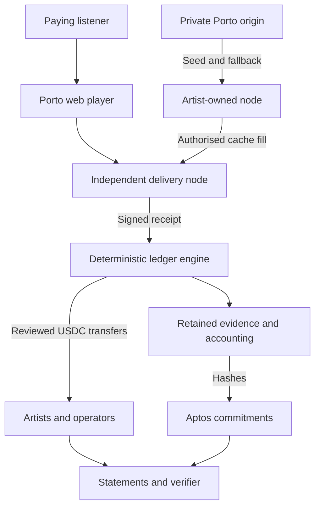
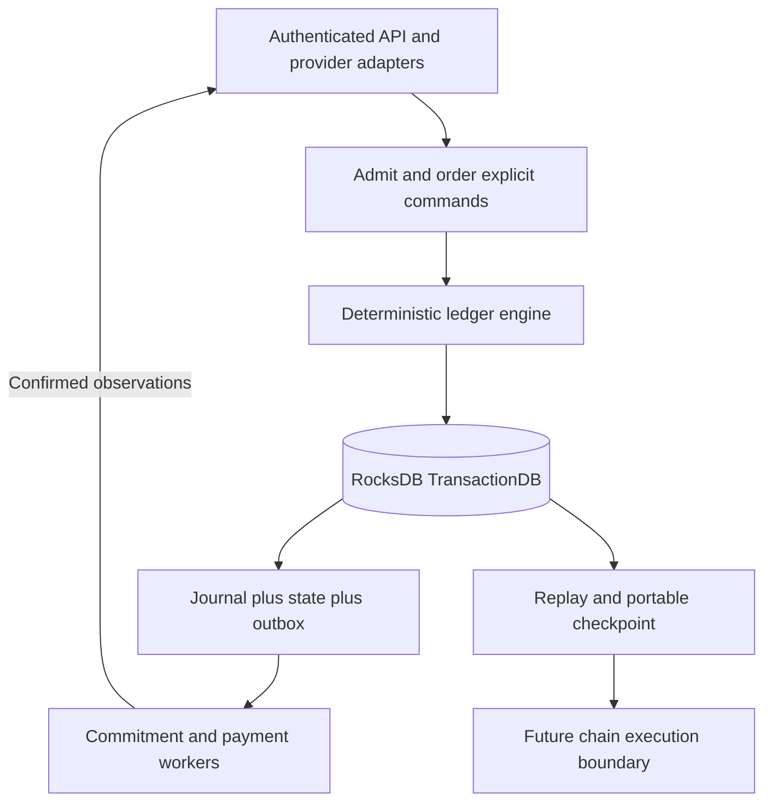

# London Mainnet architecture (APPROVED)

APPROVED FOR LONDON 0.1.0. Product-owner-approved implementation scope, not deployment, security clearance or observed pilot evidence.

## Connected knowledge

- uses: [[London delivery evidence (APPROVED)|London delivery evidence (APPROVED)]] (INFERRED)
- requires_review: [[London governance departures (APPROVED)|London governance departures (APPROVED)]] (INFERRED)
- uses: [[London deterministic RocksDB ledger (APPROVED)|London deterministic RocksDB ledger (APPROVED)]] (INFERRED)

## Source content

Source: docs/london-0.1.0/01-executive-architecture.md
## Build the ledger first

The [deterministic RocksDB ledger](27-deterministic-rocksdb-ledger.md) is the centre of this architecture and the first implementation milestone. Streaming, accounting and payout state advance through explicit, replayable commands. One Porto owner orders them today; a future sovereign runtime can take over ordering under separately specified consensus rules. The migration asset is the logical ledger and transition semantics, not a promise to copy database files into a blockchain.

Source: docs/london-0.1.0/01-executive-architecture.md
## Approved architecture

London is a deliberately small music delivery and accounting network. Porto runs the catalogue, subscriptions, routing, accounting and payout coordination. Artists and other invited parties operate delivery nodes on infrastructure they control. Aptos supplies the external ledger for commitments and USDC transfers.

The shortest complete story is: **pay, listen through a participant node, record, commit, allocate, pay artists and operators, verify**. One bounded peer cache transfer makes the infrastructure experiment concrete without requiring a public peer-discovery network.

Source: docs/london-0.1.0/01-executive-architecture.md
## Smallest implementation

One web application; one modular backend with a single RocksDB ledger owner plus restricted workers; private origin and evidence object storage; one containerised node package; one append-only Move commitment module; one payment-provider adapter and one treasury conversion adapter. A CLI is sufficient for catalogue import, operator admission, holds, run approval and exports. Do not build an admin product merely to avoid a documented manual operation.

[Contents](index.mdx) · [Implementation plan](16-implementation-plan.md) · [Launch inputs](17-open-decisions-and-risk-register.md)

Source: docs/london-0.1.0/25-node-package-and-pilot.md
## Pilot procedure

1. Invite a small cohort, targeting three to five independently operated nodes, including at least one artist and one unrelated third party. The minimum acceptance boundary is those two ownership categories, not a fabricated recruitment result.
2. Record ownership/control, who pays costs, onboarding time, assistance, licence/participation terms and any subsidy. Give operators a clear exit path.
3. Seed an authorised work onto artist node A. Keep B's selected chunks absent. Run a Porto-authorised A-to-B fill, verify source/destination evidence and ensure B serves at least one eligible real paid-listener session from those filled chunks.
4. Run real paid listening through participant nodes with Porto fallback available. Keep free/test/operator self-test sessions separately labelled and outside demand metrics and payable budgets.
5. Close accounting, anchor evidence, pay both rights and serving operators, deliver statements and have at least one external recipient verify their proof package.
6. Collect actual hosting/egress cost, time, earned reward, subsidy and willingness to continue. Observe at least one offered subscription renewal before claiming renewal evidence. Record the observation window before recruitment.

Source: docs/london-0.1.0/25-node-package-and-pilot.md
## Pilot report

Report invited/activated/retained operators by ownership type; actual peer-filled bytes; eligible independent delivery share versus fallback; successful playback/rebuffer; missing/rejected receipts; cost per eligible served hour; earned rewards versus subsidy and participant cost; cleared paying listeners, repeat listeners and renewal opportunities/outcomes; artist/operator confirmed payments; verifier outcomes; incidents and support effort.

Do not equate a working peer transfer with viable economics, willingness to sign up with retained participation, or subsidies with organic demand. The pilot may correctly conclude that the infrastructure works but participation economics need revision. That is useful evidence, not a reason to rewrite historical results.

[Contents](index.mdx) · [Implementation plan](16-implementation-plan.md) · [Launch inputs](17-open-decisions-and-risk-register.md)

Source: docs/london-0.1.0/27-deterministic-rocksdb-ledger.md
## First implementation priority

Build the deterministic streaming and accounting ledger before the surrounding product integrations. This is the approved London storage architecture and the first engineering milestone. RocksDB replaces the earlier PostgreSQL choice. The reason is an explicitly controlled, replayable state-transition engine with a portable logical state model, not an unmeasured claim that every workload is faster.

The engine owns recorded streams, eligibility decisions, funded budgets, allocations, payment obligations and their state transitions. Porto admits and orders commands in London. A future sovereign chain could supply consensus ordering around compatible rules. RocksDB supplies local persistence and transactions; it does not supply network consensus, independently verified listening or automatic chain compatibility.

Source: docs/london-0.1.0/27-deterministic-rocksdb-ledger.md
## Atomic commit procedure

Expected revisions are a list of distinct canonical state keys, sorted by key; null means the key must be absent. Record revisions start at 1 and increment once per command that updates that record. Use them for prepared allocations, artifacts and payment runs. The engine also checks all intrinsic preconditions even if a caller omits an optional optimistic revision. Result codes/entity IDs/amount must match the typed command outcome; command results never expose secret bytes.

1. Validate authentication/schema outside the transaction; copy all nondeterministic input into the envelope and persist referenced evidence durably first. A failed DB commit can leave an orphan object, never a ledger reference to bytes not yet stored.
2. Begin a TransactionDB transaction; use `GetForUpdate` on `meta/head`, `command_result/<command_id>`, and every state/uniqueness precondition key. Acquire additional keys in canonical byte order. Check expected record revisions and absence sentinels explicitly. Do not treat ordinary `Get` or an unprotected range scan as a financial lock.
3. Read a consistent transaction snapshot, run `apply`, check conservation, references and bounded output. One serial executor prevents insertion phantoms while scanning; all mutation paths must obey this ownership rule. Future parallel execution requires a separately reviewed range-conflict strategy.
4. In the same transaction append journal and immutable event rows, update authoritative state and uniqueness sentinels, store original result, create outbox intents, update transactional indexes and advance head/digest. A business rejection writes its command-result record, outcome and head; that result record is included in its delta hash. No partial accepted state is visible.
5. Commit with WAL and sync enabled. Return success only after commit reports durable success. On any uncertain I/O/commit result stop admission, reopen/recover and query the command ID before retrying. Do not assume error implies no write.
6. External workers execute durable intents after commit and submit observations as new commands. A RocksDB commit never includes the remote Aptos transfer atomically.

Bound an admitted command to 1 MiB canonical envelope, 10000 state writes and 16 MiB canonical delta. Exceeding a bound returns `COMMAND_TOO_LARGE` with no accepted mutation; do not split a monetary transition silently. Compute allocations per listener-day; aggregate immutable allocation lines into daily files outside the transaction, then freeze their references against expected day revisions. If one listener-day exceeds a limit, hold that day for a reviewed capacity change. The existing 64 MiB artifact limit remains separate.
