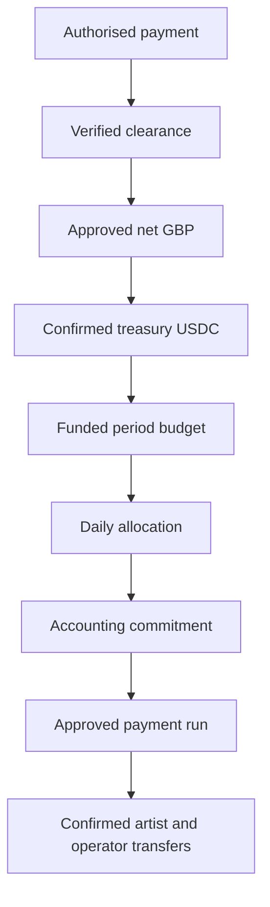

# London USDC settlement (APPROVED)

APPROVED FOR LONDON 0.1.0. Product-owner-approved implementation scope, not deployment, security clearance or observed pilot evidence.

## Connected knowledge

No outgoing links.

## Source content

Source: docs/london-0.1.0/08-usdc-treasury-and-settlement.md
## Money states and ownership

GBP subscriptions are Porto company revenue. Listeners purchase access, receive no USDC balance and own no treasury crypto. A selected provider clears payments; Porto converts approved net revenue in batches to native Aptos USDC. A funded subscription-period budget is an internal allocation record, not a customer wallet. Real provider selection, tax treatment, deductions, reserve and percentage values are required launch inputs in [configuration](26-configuration-and-release-profile.md).

Store gross GBP pence, tax/fee/refund/reserve deductions separately, approved net pence, conversion lot reference, actual net USDC received and chain evidence. Do not infer conversion from a displayed FX rate. Allocate a shared conversion lot among eligible subscription periods proportional to their approved net GBP using the largest-remainder algorithm below. Funding requires both verified clearance and a reconciled USDC receipt. Evidence can accrue before funding; monetary allocation waits and remains labelled unfunded.

Source: docs/london-0.1.0/08-usdc-treasury-and-settlement.md
## Deterministic allocation

All amounts are unsigned integer micro-USDC in storage/wire; use checked wide intermediates. GBP uses integer pence. Never float. For amount `A` and nonnegative weights `w_i`, compute `q_i=floor(A*w_i/sum(w))`; assign remaining units to descending fractional numerator remainder, ties by ascending canonical ID bytes. If all weights are zero, allocate nothing and preserve the reserve. The sum must equal A whenever positive weights exist.

1. Freeze the period's funded budget B. Allocate B across UTC service days proportional to exact covered milliseconds, ties by UTC date. This spends the monthly budget once, not once per day.
2. For each closed, unheld listener-day, sum eligible unique chunk durations per `(work_id, rights_version)`. Allocate that day's budget across those weights. Zero listening leaves that day's budget in a separately tracked unallocated reserve. It does not become Porto profit by default.
3. Split each work allocation into rights, operator and Porto shares using release-profile basis points summing to 10000, ties in order `rights`, `operator`, `porto`. Production percentages have no default. Existing protocol 70/25/5 is context, not silently ratified here.
4. Split the rights pool using the snapshotted beneficiary basis points, ties by beneficiary ID. Split the operator pool by eligible duration attributable to each serving node, ties by operator ID. A peer fill earns zero. Porto origin fallback is an explicit operator ID; its portion is recorded as Porto delivery income, not external participation.
5. Preserve listener-day/work/role contribution lines before aggregating recipient statements. A person earning both roles receives distinct statement lines even if a payment groups them to one address. Porto and origin portions remain in treasury with explicit postings, not self-transfers. No silent redistribution occurs when an operator is suspended.

Each listener-day has at most one successful allocation revision active; corrections append reversal/replacement ledger entries without deleting the prior record. A held listener-day retains its own budget until resolved. Late funding can allocate a previously closed evidence day in a later accounting run, referenced once by its original day ID.

Source: docs/london-0.1.0/08-usdc-treasury-and-settlement.md
## Safe transfer execution

Use one dedicated payout account and one serial transaction lane. No manual transfers from that account outside this system. Reserve the run's amount in the local ledger under lock after checking the confirmed balance minus unpaid reservations; gas is funded separately in APT. Contract commitments hold no funds. The payment worker validates the pinned native USDC metadata address, chain ID, approved recipient, amount and cumulative run cap before signing an ordinary framework transfer.

Persist immutable payment ID, allocated contribution IDs, recipient snapshot, sender sequence, expiry, exact signed transaction bytes and derived transaction hash durably before network submission. On timeout retry only those identical signed bytes. Query the hash and sender sequence. Never create a fresh transfer because a response was lost. If success is confirmed, reconcile asset, amount and recipient and mark paid exactly once. If confirmed abort, retain the failed attempt, account for gas and create a new attempt for the same obligation after correcting the cause. If absent, do not re-sign until ledger time exceeds expiry and trustworthy chain queries establish that the prior transaction did not succeed. Conflicting or unavailable evidence leaves the lane uncertain and blocked for manual reconciliation. Recovery must survive database restoration; see operations.

A reconciliation record includes chain ID, transaction hash, ledger version, success status, asset metadata, sender, recipient, amount and observed timestamp. Pending/aborted/wrong-asset transactions are not paid. Attach payment confirmations to a separate append-only journal, anchored after each run; never mutate the previously committed allocation statement.
