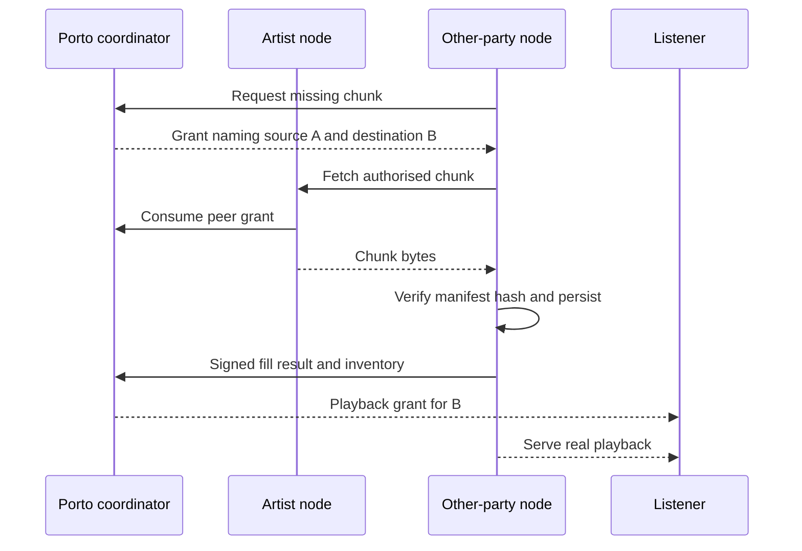

# London delivery evidence (APPROVED)

APPROVED FOR LONDON 0.1.0. Product-owner-approved implementation scope, not deployment, security clearance or observed pilot evidence.

## Connected knowledge

- informs: [[London USDC settlement (APPROVED)|London USDC settlement (APPROVED)]] (INFERRED)

## Source content

Source: docs/london-0.1.0/06-streaming-delivery-and-attestation.md
## Duration and eligibility

A receipt reports bytes actually written, HTTP outcome and the manifest chunk digest. A complete chunk requires exact declared byte length, successful response, matching consumed grant and receipt arrival within ten minutes of consumption. Transfer ends within 30 seconds of consume time. Require node times within two seconds of coordinator time at the start and ordered start/end inside the allowed interval; clock failures reject the timing claim and remove the node from routing until corrected. The coordinator ingest cutoff and consume sequence remain authoritative; signed node clocks are not independent proof of completion time. Partial/error/cancelled deliveries earn zero unless a complete valid response finished before cancellation. Receipts are assertions, not proof of attention. On-time complete receipts may close an already expired session; expiry prevents further grants, not receipt processing.

Credit each `(session_id, chunk_index)` once across all nodes and retries. Pick the valid complete receipt with lowest coordinator-assigned consume sequence; tie by receipt ID. Never use untrusted node clock to break ties. Repeated playback of the same chunk in one session earns zero additional credit. Different complete chunks contribute their manifest duration. A session becomes eligible at `min(30000, floor(work_duration_ms/2))` served milliseconds; all its unique complete chunks then contribute, including those preceding the threshold. Below-threshold sessions remain recorded but receive zero allocation. The init segment always contributes zero.

Associate a chunk with the UTC day containing coordinator consume time. Sessions close at UTC midnight, so daily attribution and eligibility are unambiguous; the player silently opens a new session and continues. At day D + 00:10, all preceding-day receipts reach their cutoff. Late receipts are retained as late, never silently inserted in a frozen batch. A support correction can link a supplementary artifact, but cannot rewrite paid history. A session also closes on explicit stop, work change, timeout or failure.

Source: docs/london-0.1.0/06-streaming-delivery-and-attestation.md
## Peer cache fill, required pilot path

Porto selects an active source node with verified inventory, and issues purpose `peer_fill` grants bound to source node, destination node and one chunk/init segment. The destination authenticates to Porto with its own credential, receives the signed grant and makes HTTPS GET to the source. The source atomically consumes it using its own node identity. The destination verifies content against the signed manifest before admitting it to cache, and submits a signed fill result linking both node IDs, grant, digest, size and outcome. TTL is 60 seconds; transfer deadline 30 seconds; at most four concurrent fills per destination. Refresh grants for further chunks, never issue whole-bucket access.

A failed peer fill retries once, then uses Porto origin via a new scoped grant. Record the source transition. Peer fills, warming, probes and test traffic are excluded from listening and operator reward duration. Retain them as infrastructure metrics only. Serving cached content to eligible real playback earns the same rate regardless of whether origin or a peer supplied the cache.

Source: docs/london-0.1.0/06-streaming-delivery-and-attestation.md
## Receipt to batch

The same backend validates receipt schema, signature/key interval, grant purpose/consumption, byte count, timing and duplicate identity. Store raw signed input plus a separate decision record. Missing receipts and held sessions remain visible in the daily inventory. Evidence preparation freezes accepted, rejected, partial, late and missing dispositions rather than hiding failures. The approved eligible subset alone feeds accounting.

No separate attestation service or fraud-review product is required. The term “attested” may describe a Porto acceptance decision only when its centralised trust is explicit. Prefer “recorded”, “eligible” and “committed” in the UI.

[Contents](index.mdx) · [Implementation plan](16-implementation-plan.md) · [Launch inputs](17-open-decisions-and-risk-register.md)

Source: docs/london-0.1.0/25-node-package-and-pilot.md
## Pilot procedure

1. Invite a small cohort, targeting three to five independently operated nodes, including at least one artist and one unrelated third party. The minimum acceptance boundary is those two ownership categories, not a fabricated recruitment result.
2. Record ownership/control, who pays costs, onboarding time, assistance, licence/participation terms and any subsidy. Give operators a clear exit path.
3. Seed an authorised work onto artist node A. Keep B's selected chunks absent. Run a Porto-authorised A-to-B fill, verify source/destination evidence and ensure B serves at least one eligible real paid-listener session from those filled chunks.
4. Run real paid listening through participant nodes with Porto fallback available. Keep free/test/operator self-test sessions separately labelled and outside demand metrics and payable budgets.
5. Close accounting, anchor evidence, pay both rights and serving operators, deliver statements and have at least one external recipient verify their proof package.
6. Collect actual hosting/egress cost, time, earned reward, subsidy and willingness to continue. Observe at least one offered subscription renewal before claiming renewal evidence. Record the observation window before recruitment.

Source: docs/london-0.1.0/25-node-package-and-pilot.md
## Pilot report

Report invited/activated/retained operators by ownership type; actual peer-filled bytes; eligible independent delivery share versus fallback; successful playback/rebuffer; missing/rejected receipts; cost per eligible served hour; earned rewards versus subsidy and participant cost; cleared paying listeners, repeat listeners and renewal opportunities/outcomes; artist/operator confirmed payments; verifier outcomes; incidents and support effort.

Do not equate a working peer transfer with viable economics, willingness to sign up with retained participation, or subsidies with organic demand. The pilot may correctly conclude that the infrastructure works but participation economics need revision. That is useful evidence, not a reason to rewrite historical results.

[Contents](index.mdx) · [Implementation plan](16-implementation-plan.md) · [Launch inputs](17-open-decisions-and-risk-register.md)
