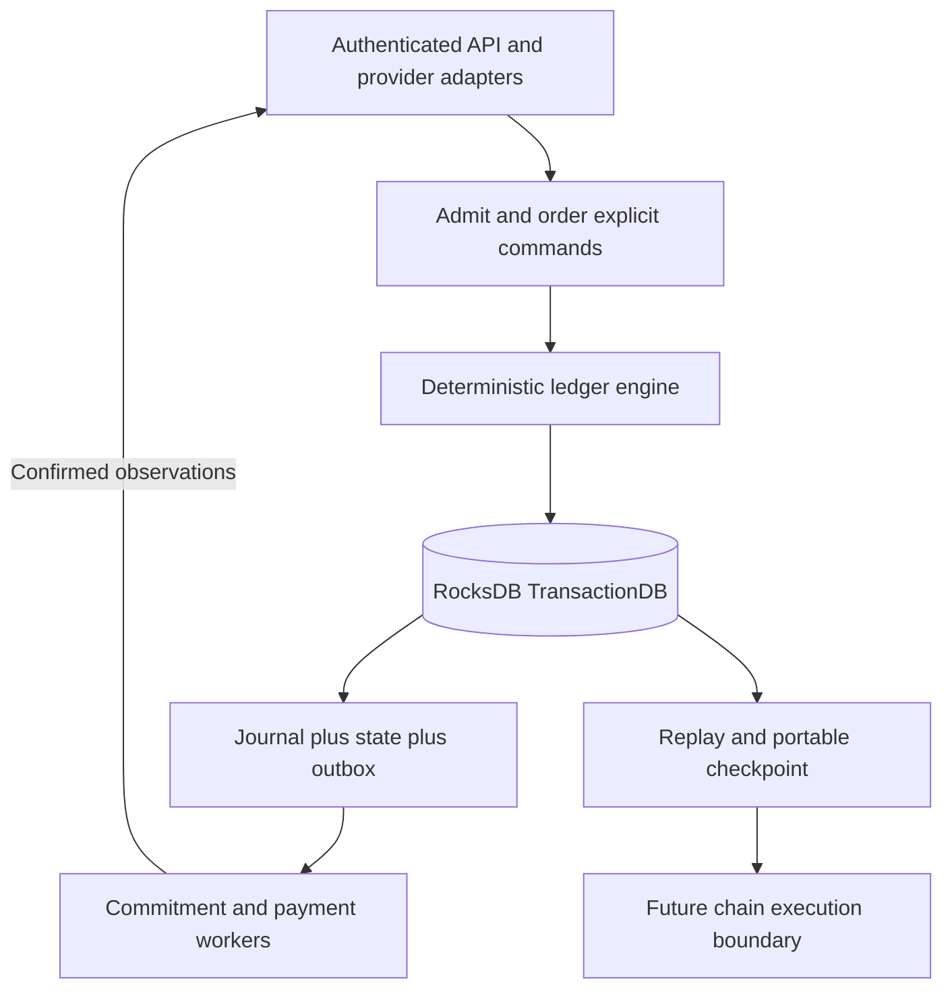

# London deterministic RocksDB ledger (APPROVED)

APPROVED FIRST IMPLEMENTATION PRIORITY. RocksDB TransactionDB with one owner, deterministic commands, atomic journal/state/outbox, durable idempotency, replay and portable logical checkpoints. Replaces PostgreSQL for London. Future sovereign-chain compatibility is a logical execution boundary, not existing consensus or physical file compatibility.

## Connected knowledge

- informs: [[London delivery evidence (APPROVED)|London delivery evidence (APPROVED)]] (INFERRED)
- informs: [[London USDC settlement (APPROVED)|London USDC settlement (APPROVED)]] (INFERRED)

## Source content

Source: docs/london-0.1.0/27-deterministic-rocksdb-ledger.md
## First implementation priority

Build the deterministic streaming and accounting ledger before the surrounding product integrations. This is the approved London storage architecture and the first engineering milestone. RocksDB replaces the earlier PostgreSQL choice. The reason is an explicitly controlled, replayable state-transition engine with a portable logical state model, not an unmeasured claim that every workload is faster.

The engine owns recorded streams, eligibility decisions, funded budgets, allocations, payment obligations and their state transitions. Porto admits and orders commands in London. A future sovereign chain could supply consensus ordering around compatible rules. RocksDB supplies local persistence and transactions; it does not supply network consensus, independently verified listening or automatic chain compatibility.



Source: docs/london-0.1.0/27-deterministic-rocksdb-ledger.md
## Pure state-transition contract

```text
apply(logical_state, admitted_command)
    -> accepted(new_values, immutable_events, effect_intents, result)
     | rejected(stable_error, result)
```

Core execution cannot read the wall clock, generate random IDs, make network requests, sign chain transactions or depend on thread scheduling. Admission supplies canonical timestamps, random IDs/nonces, verified actor identity and immutable references to verified external observations. The engine checks actor capability and state preconditions against its current logical state. Input timestamps used for expiry/leases must be nondecreasing admission time; historical provider/node event times remain separate payload fields. Timeouts are explicit commands, never hidden background mutations.

Integer arithmetic, ordering, rounding and supported policy versions follow the existing accounting specification. Iterate keys in their defined canonical order. All IDs created by a transition must be present in the admitted payload, or deterministically derived by a documented domain rule; do not call a UUID generator during replay. Unknown command/ruleset versions fail closed. Missing referenced inputs fail replay instead of fetching today's replacement data.

The adapter validates raw provider signatures, node evidence and external chain observations before constructing a command. The command contains the normalized observation and its immutable evidence digest. Replay reproduces the historical admitted observation; it does not magically re-establish the truth of the external event. Full audit can inspect the retained evidence. A future consensus runtime must define its own admission/oracle rules.

Source: docs/london-0.1.0/27-deterministic-rocksdb-ledger.md
## Atomic commit procedure

Expected revisions are a list of distinct canonical state keys, sorted by key; null means the key must be absent. Record revisions start at 1 and increment once per command that updates that record. Use them for prepared allocations, artifacts and payment runs. The engine also checks all intrinsic preconditions even if a caller omits an optional optimistic revision. Result codes/entity IDs/amount must match the typed command outcome; command results never expose secret bytes.

1. Validate authentication/schema outside the transaction; copy all nondeterministic input into the envelope and persist referenced evidence durably first. A failed DB commit can leave an orphan object, never a ledger reference to bytes not yet stored.
2. Begin a TransactionDB transaction; use `GetForUpdate` on `meta/head`, `command_result/<command_id>`, and every state/uniqueness precondition key. Acquire additional keys in canonical byte order. Check expected record revisions and absence sentinels explicitly. Do not treat ordinary `Get` or an unprotected range scan as a financial lock.
3. Read a consistent transaction snapshot, run `apply`, check conservation, references and bounded output. One serial executor prevents insertion phantoms while scanning; all mutation paths must obey this ownership rule. Future parallel execution requires a separately reviewed range-conflict strategy.
4. In the same transaction append journal and immutable event rows, update authoritative state and uniqueness sentinels, store original result, create outbox intents, update transactional indexes and advance head/digest. A business rejection writes its command-result record, outcome and head; that result record is included in its delta hash. No partial accepted state is visible.
5. Commit with WAL and sync enabled. Return success only after commit reports durable success. On any uncertain I/O/commit result stop admission, reopen/recover and query the command ID before retrying. Do not assume error implies no write.
6. External workers execute durable intents after commit and submit observations as new commands. A RocksDB commit never includes the remote Aptos transfer atomically.

Bound an admitted command to 1 MiB canonical envelope, 10000 state writes and 16 MiB canonical delta. Exceeding a bound returns `COMMAND_TOO_LARGE` with no accepted mutation; do not split a monetary transition silently. Compute allocations per listener-day; aggregate immutable allocation lines into daily files outside the transaction, then freeze their references against expected day revisions. If one listener-day exceeds a limit, hold that day for a reviewed capacity change. The existing 64 MiB artifact limit remains separate.

Source: docs/london-0.1.0/27-deterministic-rocksdb-ledger.md
## Recovery and future chain boundary

Keep local WAL and synchronous commits; create a verified off-host backup/checkpoint at least every five minutes, satisfying the existing pilot RPO target only when measured. Preserve the independent off-host signed-payment journal before broadcast. After host loss, restore the latest verified checkpoint and available journal suffix, keep dispatch/signing disabled, reconcile all external effects against the signed-payment journal and chain, and only then resume under a new approved owner. Ledger replay must never resend a historical effect merely because its old acknowledgement is absent.

For future sovereign execution, retain typed commands, pure transition rules, stable IDs, exact money arithmetic and portable checkpoint exports. A later migration selects the permitted public/replicated subset, reconciles obligations, defines trusted genesis/checkpoint import and changes admission/ordering to the chosen consensus runtime. Private_aux, listener histories and secret/provider material do not become validator state by default. Byte-compatible RocksDB files, a Move implementation, asset bridging and consensus integration are not promised by this design. Existing Aptos transfers remain on Aptos.

Source: docs/london-0.1.0/16-implementation-plan.md
## Attack this first: W0 and W1 ledger engine

Start with [the deterministic RocksDB ledger](27-deterministic-rocksdb-ledger.md). The immediate deliverable is a working pure command executor and single-owner TransactionDB adapter that atomically persist stream/accounting state, replay identically, recover from crashes and export a portable checkpoint. Use synthetic inputs and mocked external effects. Do not begin by building dashboards, provider orchestration or a chain.

W1 must pass A41-A48 before the first real integration milestone. Frontend fixture work may proceed independently, but it cannot change this dependency. This priority is an approved architectural decision, not a speculative optimisation.

Source: docs/london-0.1.0/15-migration-to-porto-app-chain.md
## Deterministic ledger as the migration boundary

London now builds the RocksDB ledger, pure state-transition functions, canonical command journal, deterministic replay and portable checkpoint format as its first milestone. A later sovereign chain could replace Porto command ordering with consensus while preserving compatible domain rules. PostgreSQL is no longer the authoritative-store choice for London.

The reusable contract is logical state and execution semantics. Shared use of RocksDB does not guarantee identical storage layout, code reuse in a Move VM, consensus safety or an asset bridge. The future migration must choose which state is replicated, preserve private data boundaries and test a deterministic conversion if the target runtime differs. Required now: export/import and replay in a clean local engine with matching digests. Deferred: actual genesis admission, consensus integration, validator operation and live chain cutover.
